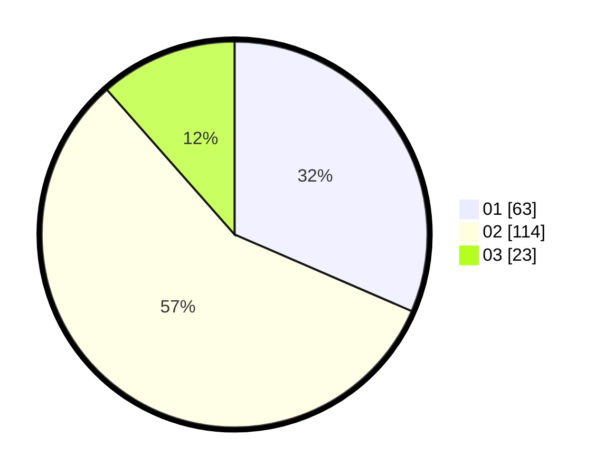

# Hasil

Hasil perolehan suara paslon dapat dilihat pada file paslon-01.txt, paslon-02.txt, dan paslon-03.txt.

Jika tidak ada, artinya data tersebut belum ada pada SIREKAP.

## Perolehan Suara

 * Paslon 01: **63**.
 * Paslon 02: **114**.
 * Paslon 03: **23**.

## Foto C Plano

https://sirekap-obj-formc.kpu.go.id/73d1/pemilu/ppwp/31/72/04/10/01/3172041001035-20240214-210747--76fa3171-eefb-403e-8035-cacff42b5245.jpg

https://sirekap-obj-formc.kpu.go.id/73d1/pemilu/ppwp/31/72/04/10/01/3172041001035-20240214-210802--119b25d7-3c1d-4184-9bc7-175b87ac0cf5.jpg

https://sirekap-obj-formc.kpu.go.id/73d1/pemilu/ppwp/31/72/04/10/01/3172041001035-20240214-210812--3e1d8e15-3c07-4c51-b700-c11aa2650103.jpg

## DATA PEMILIH TETAP

Jumlah pemilih dalam DPT: **288**.
 * L: **146**.
 * P: **142**.

## DATA PENGGUNA HAK PILIH

Jumlah pengguna hak pilih dalam DPT: **196**.
 * L: **92**.
 * P: **104**.

Jumlah pengguna hak pilih dalam DPTb: **0**.
 * L: **0**.
 * P: **0**.

Jumlah pengguna hak pilih dalam DPK: **6**.
 * L: **4**.
 * P: **2**.

Jumlah pengguna hak pilih: **202**.
 * L: **96**.
 * P: **106**.

## JUMLAH SUARA SAH DAN TIDAK SAH

JUMLAH SELURUH SUARA SAH: **200**.

JUMLAH SUARA TIDAK SAH: **2**.

JUMLAH SELURUH SUARA SAH DAN SUARA TIDAK SAH: **202**.
