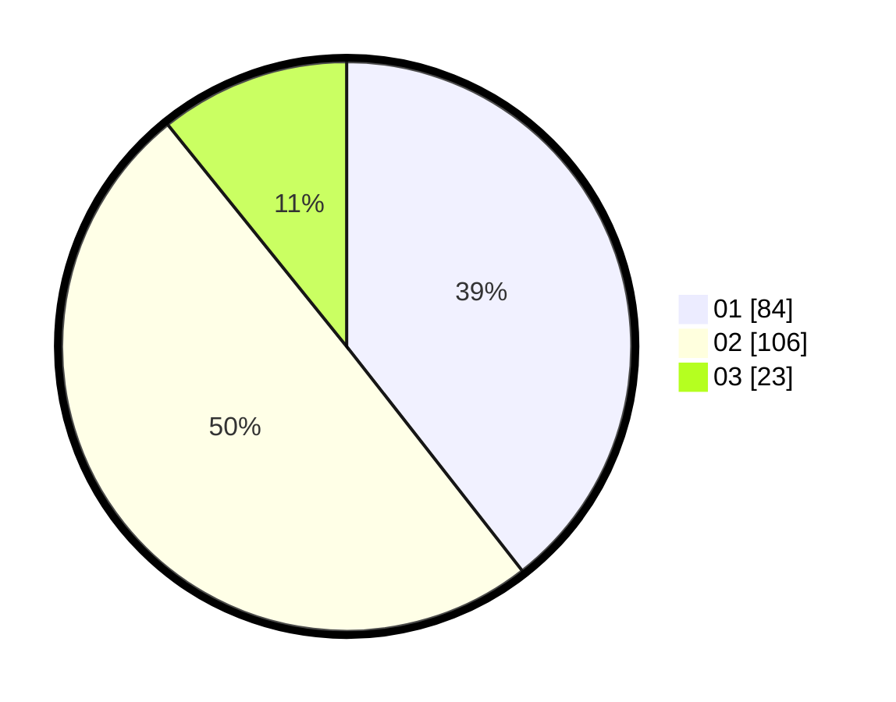

# Hasil

Hasil perolehan suara paslon dapat dilihat pada file paslon-01.txt, paslon-02.txt, dan paslon-03.txt.

Jika tidak ada, artinya data tersebut belum ada pada SIREKAP.

## Perolehan Suara

 * Paslon 01: **84**.
 * Paslon 02: **106**.
 * Paslon 03: **23**.

## Foto C Plano

https://sirekap-obj-formc.kpu.go.id/ac53/pemilu/ppwp/31/72/04/10/01/3172041001047-20240215-010000--765ee08b-79f1-4567-8660-f8af511d86d1.jpg

https://sirekap-obj-formc.kpu.go.id/ac53/pemilu/ppwp/31/72/04/10/01/3172041001047-20240215-005940--eb9b68b0-5923-469b-a343-c913611d25da.jpg

https://sirekap-obj-formc.kpu.go.id/ac53/pemilu/ppwp/31/72/04/10/01/3172041001047-20240215-010044--c0c2a0f8-217e-42bf-be18-4a54235800d2.jpg
