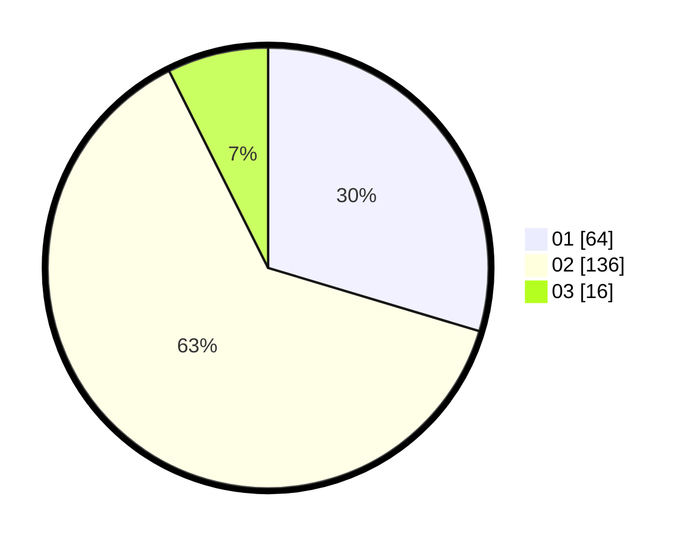

# Hasil

Hasil perolehan suara paslon dapat dilihat pada file paslon-01.txt, paslon-02.txt, dan paslon-03.txt.

Jika tidak ada, artinya data tersebut belum ada pada SIREKAP.

## Perolehan Suara

 * Paslon 01: **64**.
 * Paslon 02: **136**.
 * Paslon 03: **16**.

## Foto C Plano

https://sirekap-obj-formc.kpu.go.id/3b49/pemilu/ppwp/31/72/04/10/01/3172041001054-20240214-214448--797e1d18-1f63-4634-8458-ad21143c8bad.jpg

https://sirekap-obj-formc.kpu.go.id/3b49/pemilu/ppwp/31/72/04/10/01/3172041001054-20240214-192723--74ecf0a3-45f4-49b1-806b-1764b5d1ed54.jpg

https://sirekap-obj-formc.kpu.go.id/3b49/pemilu/ppwp/31/72/04/10/01/3172041001054-20240214-215250--39fb0cd2-6f69-4eef-b032-6f4158caf759.jpg
