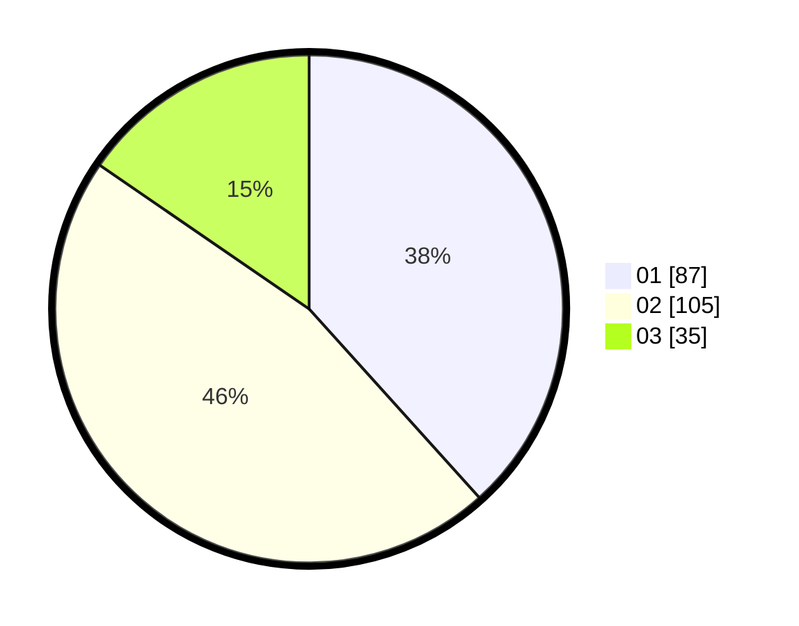

# Hasil

Hasil perolehan suara paslon dapat dilihat pada file paslon-01.txt, paslon-02.txt, dan paslon-03.txt.

Jika tidak ada, artinya data tersebut belum ada pada SIREKAP.

## Perolehan Suara

 * Paslon 01: **87**.
 * Paslon 02: **105**.
 * Paslon 03: **35**.

## Foto C Plano

https://sirekap-obj-formc.kpu.go.id/5bb1/pemilu/ppwp/31/72/04/10/01/3172041001057-20240214-175444--8dc5e221-53ca-40f8-a08d-f64e19e2e3a6.jpg

https://sirekap-obj-formc.kpu.go.id/5bb1/pemilu/ppwp/31/72/04/10/01/3172041001057-20240215-085403--c6e64519-5b72-4d99-ab33-6fd0e1a410cb.jpg

https://sirekap-obj-formc.kpu.go.id/5bb1/pemilu/ppwp/31/72/04/10/01/3172041001057-20240215-085527--90672cda-2a96-41bc-86de-bc05e04888a3.jpg

## DATA PEMILIH TETAP

Jumlah pemilih dalam DPT: **290**.
 * L: **138**.
 * P: **152**.

## DATA PENGGUNA HAK PILIH

Jumlah pengguna hak pilih dalam DPT: **228**.
 * L: **101**.
 * P: **127**.

Jumlah pengguna hak pilih dalam DPTb: **1**.
 * L: **0**.
 * P: **1**.

Jumlah pengguna hak pilih dalam DPK: **0**.
 * L: **0**.
 * P: **0**.

Jumlah pengguna hak pilih: **229**.
 * L: **101**.
 * P: **128**.

## JUMLAH SUARA SAH DAN TIDAK SAH

JUMLAH SELURUH SUARA SAH: **227**.

JUMLAH SUARA TIDAK SAH: **2**.

JUMLAH SELURUH SUARA SAH DAN SUARA TIDAK SAH: **229**.
