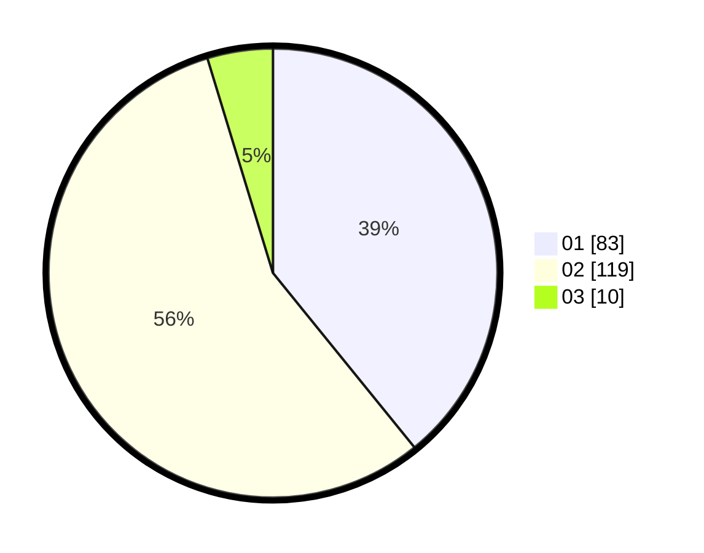

# Hasil

Hasil perolehan suara paslon dapat dilihat pada file paslon-01.txt, paslon-02.txt, dan paslon-03.txt.

Jika tidak ada, artinya data tersebut belum ada pada SIREKAP.

## Perolehan Suara

 * Paslon 01: **83**.
 * Paslon 02: **119**.
 * Paslon 03: **10**.

## Foto C Plano

https://sirekap-obj-formc.kpu.go.id/0505/pemilu/ppwp/31/72/04/10/01/3172041001113-20240214-204935--d2371374-80d0-4793-9033-102a7db4c8e0.jpg

https://sirekap-obj-formc.kpu.go.id/0505/pemilu/ppwp/31/72/04/10/01/3172041001113-20240214-220528--5e66c43d-412a-46cd-8caf-fd51466e98b2.jpg

https://sirekap-obj-formc.kpu.go.id/0505/pemilu/ppwp/31/72/04/10/01/3172041001113-20240214-160102--fa2090a7-6c0b-41a4-86a3-b586fe2a4b6b.jpg

## DATA PEMILIH TETAP

Jumlah pemilih dalam DPT: **290**.
 * L: **148**.
 * P: **142**.

## DATA PENGGUNA HAK PILIH

Jumlah pengguna hak pilih dalam DPT: **213**.
 * L: **104**.
 * P: **199**.

Jumlah pengguna hak pilih dalam DPTb: **7**.
 * L: **0**.
 * P: **0**.

Jumlah pengguna hak pilih dalam DPK: **0**.
 * L: **0**.
 * P: **0**.

Jumlah pengguna hak pilih: **213**.
 * L: **107**.
 * P: **109**.

## JUMLAH SUARA SAH DAN TIDAK SAH

JUMLAH SELURUH SUARA SAH: **212**.

JUMLAH SUARA TIDAK SAH: **1**.

JUMLAH SELURUH SUARA SAH DAN SUARA TIDAK SAH: **213**.
