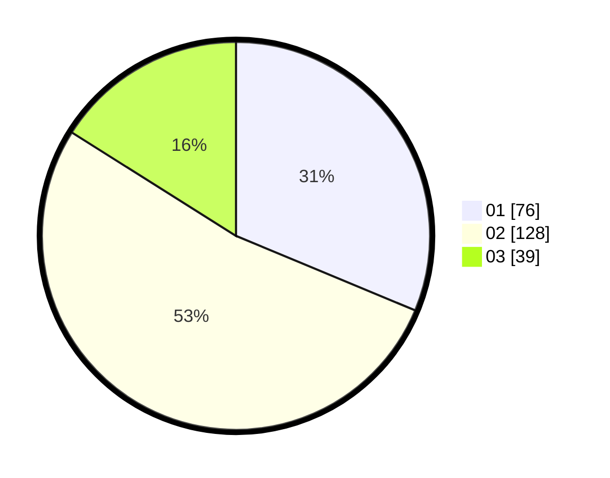

# Hasil

Hasil perolehan suara paslon dapat dilihat pada file paslon-01.txt, paslon-02.txt, dan paslon-03.txt.

Jika tidak ada, artinya data tersebut belum ada pada SIREKAP.

## Perolehan Suara

 * Paslon 01: **76**.
 * Paslon 02: **128**.
 * Paslon 03: **39**.

## Foto C Plano

https://sirekap-obj-formc.kpu.go.id/adc1/pemilu/ppwp/31/72/04/10/01/3172041001142-20240215-023743--8570240c-afb0-4694-8ceb-b25e1a9ac48e.jpg

https://sirekap-obj-formc.kpu.go.id/adc1/pemilu/ppwp/31/72/04/10/01/3172041001142-20240214-201421--245b1aeb-fee6-4402-8577-64a7aec1ca43.jpg

https://sirekap-obj-formc.kpu.go.id/adc1/pemilu/ppwp/31/72/04/10/01/3172041001142-20240214-201522--d14f1deb-4354-47da-8db0-4dbdc423eb7a.jpg

## DATA PEMILIH TETAP

Jumlah pemilih dalam DPT: **287**.
 * L: **140**.
 * P: **147**.

## DATA PENGGUNA HAK PILIH

Jumlah pengguna hak pilih dalam DPT: **242**.
 * L: **115**.
 * P: **127**.

Jumlah pengguna hak pilih dalam DPTb: **4**.
 * L: **2**.
 * P: **2**.

Jumlah pengguna hak pilih dalam DPK: **1**.
 * L: **0**.
 * P: **1**.

Jumlah pengguna hak pilih: **247**.
 * L: **117**.
 * P: **130**.

## JUMLAH SUARA SAH DAN TIDAK SAH

JUMLAH SELURUH SUARA SAH: **243**.

JUMLAH SUARA TIDAK SAH: **4**.

JUMLAH SELURUH SUARA SAH DAN SUARA TIDAK SAH: **247**.
