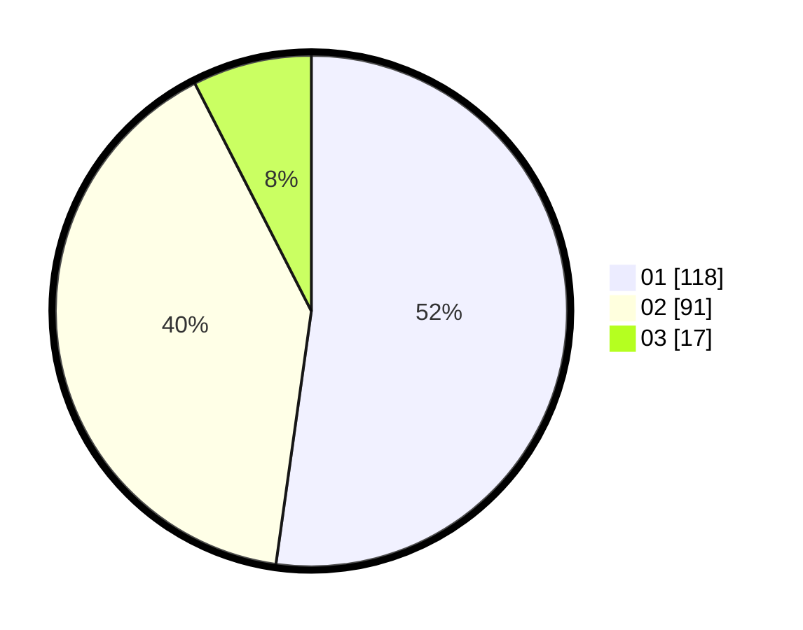

# Hasil

Hasil perolehan suara paslon dapat dilihat pada file paslon-01.txt, paslon-02.txt, dan paslon-03.txt.

Jika tidak ada, artinya data tersebut belum ada pada SIREKAP.

## Perolehan Suara

 * Paslon 01: **118**.
 * Paslon 02: **91**.
 * Paslon 03: **17**.

## Foto C Plano

https://sirekap-obj-formc.kpu.go.id/ca4d/pemilu/ppwp/31/72/04/10/02/3172041002001-20240214-195024--95c0ff3e-73c6-4d46-9e75-865d5243ba66.jpg

https://sirekap-obj-formc.kpu.go.id/ca4d/pemilu/ppwp/31/72/04/10/02/3172041002001-20240214-215851--0fafd085-0a70-4a93-a492-a1d367295b97.jpg

https://sirekap-obj-formc.kpu.go.id/ca4d/pemilu/ppwp/31/72/04/10/02/3172041002001-20240214-195207--b45ffb22-5583-4f0f-815b-93cfd7d9c6ba.jpg

## DATA PEMILIH TETAP

Jumlah pemilih dalam DPT: **294**.
 * L: **148**.
 * P: **146**.

## DATA PENGGUNA HAK PILIH

Jumlah pengguna hak pilih dalam DPT: **225**.
 * L: **107**.
 * P: **118**.

Jumlah pengguna hak pilih dalam DPTb: **3**.
 * L: **1**.
 * P: **2**.

Jumlah pengguna hak pilih dalam DPK: **2**.
 * L: **0**.
 * P: **2**.

Jumlah pengguna hak pilih: **230**.
 * L: **108**.
 * P: **122**.

## JUMLAH SUARA SAH DAN TIDAK SAH

JUMLAH SELURUH SUARA SAH: **226**.

JUMLAH SUARA TIDAK SAH: **4**.

JUMLAH SELURUH SUARA SAH DAN SUARA TIDAK SAH: **230**.
