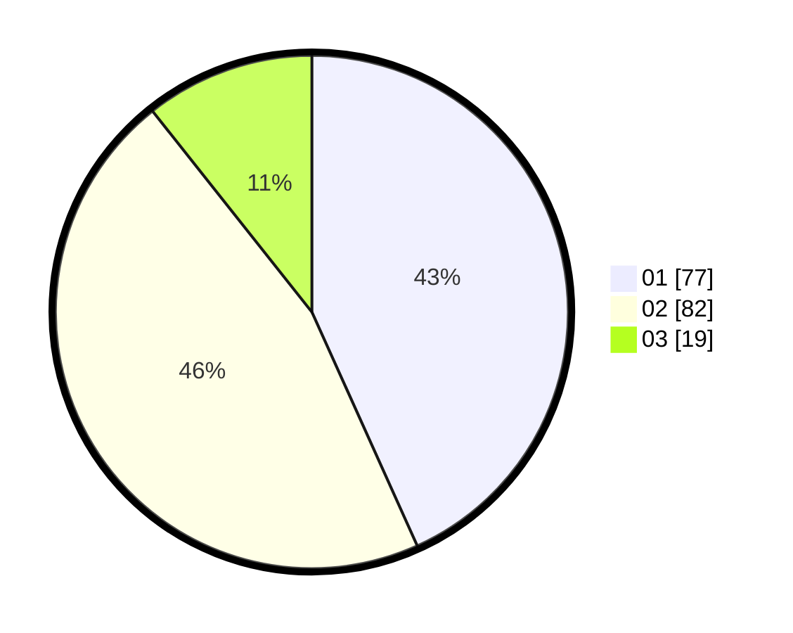

# Hasil

Hasil perolehan suara paslon dapat dilihat pada file paslon-01.txt, paslon-02.txt, dan paslon-03.txt.

Jika tidak ada, artinya data tersebut belum ada pada SIREKAP.

## Perolehan Suara

 * Paslon 01: **77**.
 * Paslon 02: **82**.
 * Paslon 03: **19**.

## Foto C Plano

https://sirekap-obj-formc.kpu.go.id/c66c/pemilu/ppwp/31/72/04/10/02/3172041002003-20240214-233409--f067dabb-79cc-4c92-bb4b-308b6593fd7b.jpg

https://sirekap-obj-formc.kpu.go.id/c66c/pemilu/ppwp/31/72/04/10/02/3172041002003-20240215-000707--c5328f74-9d94-42eb-8536-78e91afeb542.jpg

https://sirekap-obj-formc.kpu.go.id/c66c/pemilu/ppwp/31/72/04/10/02/3172041002003-20240215-000933--ea4d7e61-4159-4e32-807d-cfe96af27c8a.jpg
