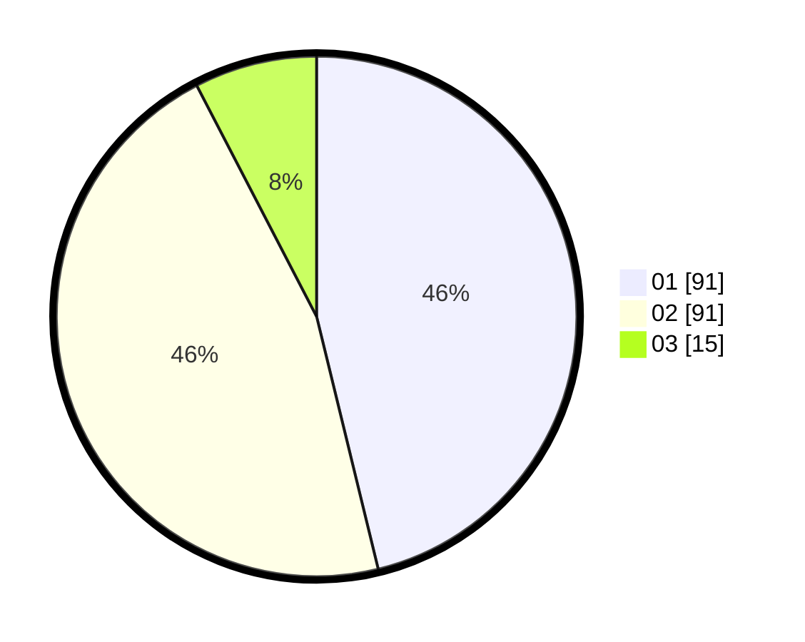

# Hasil

Hasil perolehan suara paslon dapat dilihat pada file paslon-01.txt, paslon-02.txt, dan paslon-03.txt.

Jika tidak ada, artinya data tersebut belum ada pada SIREKAP.

## Perolehan Suara

 * Paslon 01: **91**.
 * Paslon 02: **91**.
 * Paslon 03: **15**.

## Foto C Plano

https://sirekap-obj-formc.kpu.go.id/e392/pemilu/ppwp/31/72/04/10/02/3172041002006-20240214-201940--3c54be79-372f-4489-b60e-ff34b4b601a0.jpg

https://sirekap-obj-formc.kpu.go.id/e392/pemilu/ppwp/31/72/04/10/02/3172041002006-20240214-224059--24003726-5cdb-45fe-843f-125f8afaac36.jpg

https://sirekap-obj-formc.kpu.go.id/e392/pemilu/ppwp/31/72/04/10/02/3172041002006-20240214-225301--09bc1cc9-4af7-4177-b685-0b0d6f1be233.jpg

## DATA PEMILIH TETAP

Jumlah pemilih dalam DPT: **287**.
 * L: **148**.
 * P: **139**.

## DATA PENGGUNA HAK PILIH

Jumlah pengguna hak pilih dalam DPT: **197**.
 * L: **102**.
 * P: **95**.

Jumlah pengguna hak pilih dalam DPTb: **1**.
 * L: **0**.
 * P: **1**.

Jumlah pengguna hak pilih dalam DPK: **1**.
 * L: **0**.
 * P: **1**.

Jumlah pengguna hak pilih: **199**.
 * L: **102**.
 * P: **97**.

## JUMLAH SUARA SAH DAN TIDAK SAH

JUMLAH SELURUH SUARA SAH: **197**.

JUMLAH SUARA TIDAK SAH: **2**.

JUMLAH SELURUH SUARA SAH DAN SUARA TIDAK SAH: **199**.
