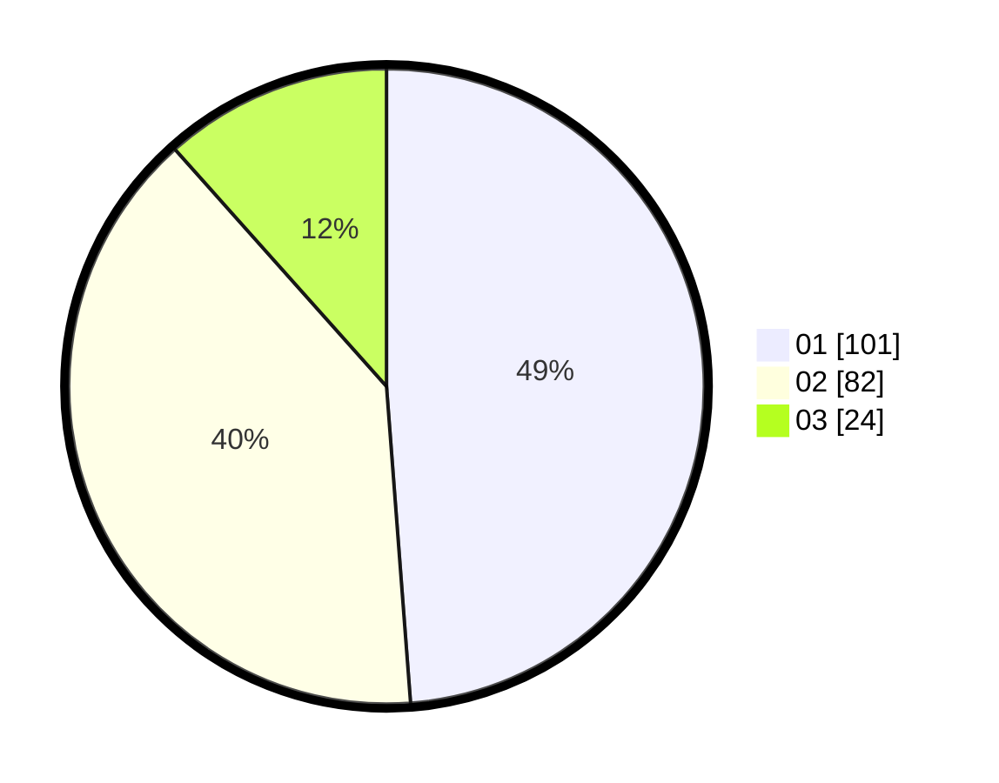

# Hasil

Hasil perolehan suara paslon dapat dilihat pada file paslon-01.txt, paslon-02.txt, dan paslon-03.txt.

Jika tidak ada, artinya data tersebut belum ada pada SIREKAP.

## Perolehan Suara

 * Paslon 01: **101**.
 * Paslon 02: **82**.
 * Paslon 03: **24**.

## Foto C Plano

https://sirekap-obj-formc.kpu.go.id/d5f3/pemilu/ppwp/31/72/04/10/02/3172041002009-20240214-185301--24f76ae8-7379-4710-bf2e-4d03e89e0159.jpg

https://sirekap-obj-formc.kpu.go.id/d5f3/pemilu/ppwp/31/72/04/10/02/3172041002009-20240214-185305--7f8b7684-d276-4a62-9eda-cbbc4cecac83.jpg

https://sirekap-obj-formc.kpu.go.id/d5f3/pemilu/ppwp/31/72/04/10/02/3172041002009-20240214-185311--268a6d14-3f8c-422a-bc53-5afe2ce08afc.jpg

## DATA PEMILIH TETAP

Jumlah pemilih dalam DPT: **281**.
 * L: **135**.
 * P: **146**.

## DATA PENGGUNA HAK PILIH

Jumlah pengguna hak pilih dalam DPT: **203**.
 * L: **93**.
 * P: **110**.

Jumlah pengguna hak pilih dalam DPTb: **3**.
 * L: **0**.
 * P: **3**.

Jumlah pengguna hak pilih dalam DPK: **4**.
 * L: **2**.
 * P: **2**.

Jumlah pengguna hak pilih: **210**.
 * L: **95**.
 * P: **115**.

## JUMLAH SUARA SAH DAN TIDAK SAH

JUMLAH SELURUH SUARA SAH: **207**.

JUMLAH SUARA TIDAK SAH: **3**.

JUMLAH SELURUH SUARA SAH DAN SUARA TIDAK SAH: **210**.
