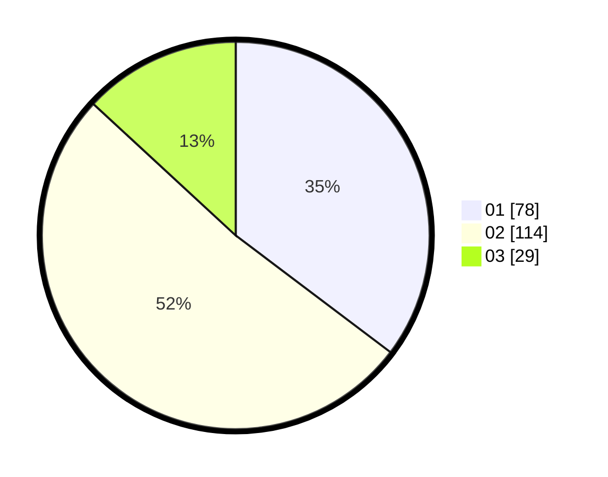

# Hasil

Hasil perolehan suara paslon dapat dilihat pada file paslon-01.txt, paslon-02.txt, dan paslon-03.txt.

Jika tidak ada, artinya data tersebut belum ada pada SIREKAP.

## Perolehan Suara

 * Paslon 01: **78**.
 * Paslon 02: **114**.
 * Paslon 03: **29**.

## Foto C Plano

https://sirekap-obj-formc.kpu.go.id/264c/pemilu/ppwp/31/72/04/10/02/3172041002012-20240216-211937--28931560-5504-402c-b991-4dd7c7c7520c.jpg

https://sirekap-obj-formc.kpu.go.id/264c/pemilu/ppwp/31/72/04/10/02/3172041002012-20240216-212252--c7a302c1-17c7-4536-9977-7edd2edbbb80.jpg

https://sirekap-obj-formc.kpu.go.id/264c/pemilu/ppwp/31/72/04/10/02/3172041002012-20240216-212402--fc73fa65-0ca4-4e39-bf89-942a28c704c4.jpg

## DATA PEMILIH TETAP

Jumlah pemilih dalam DPT: **291**.
 * L: **140**.
 * P: **151**.

## DATA PENGGUNA HAK PILIH

Jumlah pengguna hak pilih dalam DPT: **223**.
 * L: **103**.
 * P: **120**.

Jumlah pengguna hak pilih dalam DPTb: **2**.
 * L: **1**.
 * P: **1**.

Jumlah pengguna hak pilih dalam DPK: **0**.
 * L: **0**.
 * P: **0**.

Jumlah pengguna hak pilih: **225**.
 * L: **104**.
 * P: **121**.

## JUMLAH SUARA SAH DAN TIDAK SAH

JUMLAH SELURUH SUARA SAH: **221**.

JUMLAH SUARA TIDAK SAH: **4**.

JUMLAH SELURUH SUARA SAH DAN SUARA TIDAK SAH: **225**.
