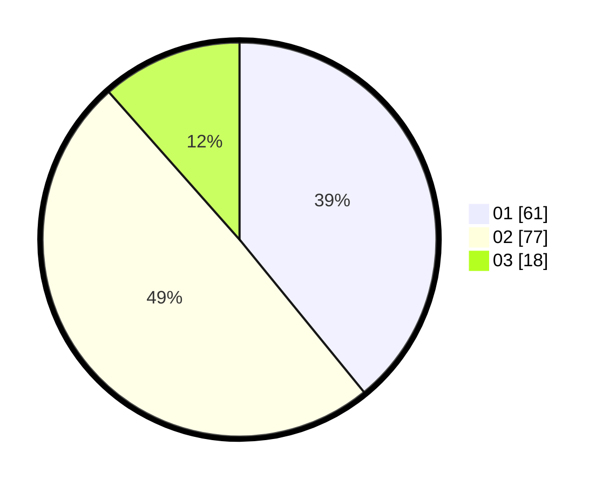

# Hasil

Hasil perolehan suara paslon dapat dilihat pada file paslon-01.txt, paslon-02.txt, dan paslon-03.txt.

Jika tidak ada, artinya data tersebut belum ada pada SIREKAP.

## Perolehan Suara

 * Paslon 01: **61**.
 * Paslon 02: **77**.
 * Paslon 03: **18**.

## Foto C Plano

https://sirekap-obj-formc.kpu.go.id/8a47/pemilu/ppwp/31/72/04/10/02/3172041002018-20240214-155212--5dda4fac-f61b-42e4-8646-9c0207cd408c.jpg

https://sirekap-obj-formc.kpu.go.id/8a47/pemilu/ppwp/31/72/04/10/02/3172041002018-20240214-160055--86c51868-16d3-402a-ba40-c48290ad4cbc.jpg

https://sirekap-obj-formc.kpu.go.id/8a47/pemilu/ppwp/31/72/04/10/02/3172041002018-20240214-155853--990569d7-a223-4daf-b40a-6fae7bf8ff57.jpg

## DATA PEMILIH TETAP

Jumlah pemilih dalam DPT: **282**.
 * L: **135**.
 * P: **147**.

## DATA PENGGUNA HAK PILIH

Jumlah pengguna hak pilih dalam DPT: **151**.
 * L: **67**.
 * P: **84**.

Jumlah pengguna hak pilih dalam DPTb: **1**.
 * L: **1**.
 * P: **0**.

Jumlah pengguna hak pilih dalam DPK: **5**.
 * L: **2**.
 * P: **3**.

Jumlah pengguna hak pilih: **157**.
 * L: **70**.
 * P: **87**.

## JUMLAH SUARA SAH DAN TIDAK SAH

JUMLAH SELURUH SUARA SAH: **156**.

JUMLAH SUARA TIDAK SAH: **1**.

JUMLAH SELURUH SUARA SAH DAN SUARA TIDAK SAH: **157**.
