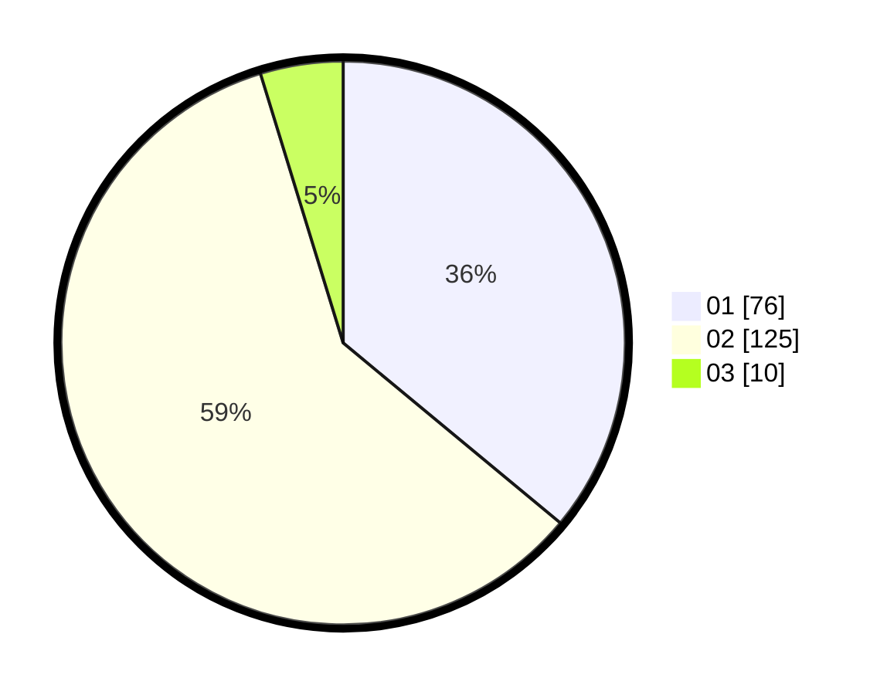

# Hasil

Hasil perolehan suara paslon dapat dilihat pada file paslon-01.txt, paslon-02.txt, dan paslon-03.txt.

Jika tidak ada, artinya data tersebut belum ada pada SIREKAP.

## Perolehan Suara

 * Paslon 01: **76**.
 * Paslon 02: **125**.
 * Paslon 03: **10**.

## Foto C Plano

https://sirekap-obj-formc.kpu.go.id/c089/pemilu/ppwp/31/72/04/10/02/3172041002037-20240215-020944--8c6f5f91-e519-41c8-9569-a650298ed1c8.jpg

https://sirekap-obj-formc.kpu.go.id/c089/pemilu/ppwp/31/72/04/10/02/3172041002037-20240215-020750--dbd5212d-aec5-48e2-9bfd-07c6aa3cceab.jpg

https://sirekap-obj-formc.kpu.go.id/c089/pemilu/ppwp/31/72/04/10/02/3172041002037-20240215-020851--858354fc-565d-44ab-a433-f4e43089db2d.jpg

## DATA PEMILIH TETAP

Jumlah pemilih dalam DPT: **286**.
 * L: **150**.
 * P: **136**.

## DATA PENGGUNA HAK PILIH

Jumlah pengguna hak pilih dalam DPT: **214**.
 * L: **107**.
 * P: **107**.

Jumlah pengguna hak pilih dalam DPTb: **0**.
 * L: **0**.
 * P: **0**.

Jumlah pengguna hak pilih dalam DPK: **0**.
 * L: **0**.
 * P: **0**.

Jumlah pengguna hak pilih: **214**.
 * L: **107**.
 * P: **107**.

## JUMLAH SUARA SAH DAN TIDAK SAH

JUMLAH SELURUH SUARA SAH: **211**.

JUMLAH SUARA TIDAK SAH: **3**.

JUMLAH SELURUH SUARA SAH DAN SUARA TIDAK SAH: **214**.
