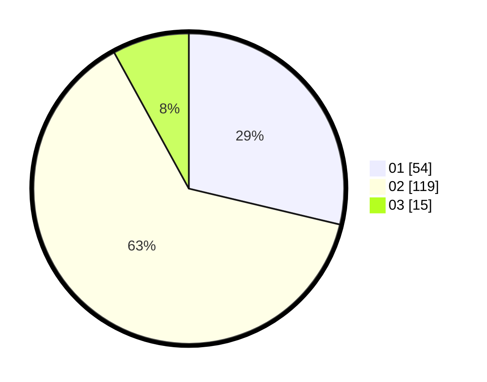

# Hasil

Hasil perolehan suara paslon dapat dilihat pada file paslon-01.txt, paslon-02.txt, dan paslon-03.txt.

Jika tidak ada, artinya data tersebut belum ada pada SIREKAP.

## Perolehan Suara

 * Paslon 01: **54**.
 * Paslon 02: **119**.
 * Paslon 03: **15**.

## Foto C Plano

https://sirekap-obj-formc.kpu.go.id/6673/pemilu/ppwp/31/72/04/10/02/3172041002048-20240214-235109--750378db-e4b2-4b25-8fca-f306adb2d89a.jpg

https://sirekap-obj-formc.kpu.go.id/6673/pemilu/ppwp/31/72/04/10/02/3172041002048-20240214-235407--48f4d477-5b36-4131-ba7e-32f151cc1051.jpg

https://sirekap-obj-formc.kpu.go.id/6673/pemilu/ppwp/31/72/04/10/02/3172041002048-20240214-235626--df54ff94-4536-4e4f-9a0f-54f619ba52b2.jpg
