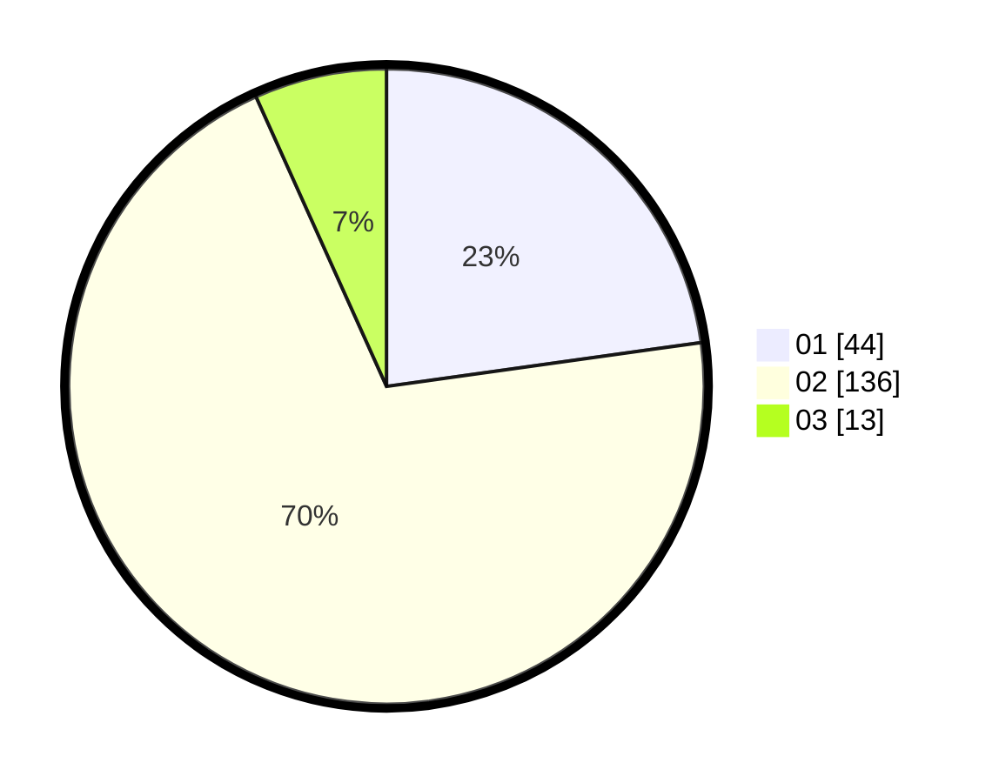

# Hasil

Hasil perolehan suara paslon dapat dilihat pada file paslon-01.txt, paslon-02.txt, dan paslon-03.txt.

Jika tidak ada, artinya data tersebut belum ada pada SIREKAP.

## Perolehan Suara

 * Paslon 01: **44**.
 * Paslon 02: **136**.
 * Paslon 03: **13**.

## Foto C Plano

https://sirekap-obj-formc.kpu.go.id/8fa0/pemilu/ppwp/31/72/04/10/02/3172041002049-20240214-231328--2eb48f05-34eb-4ab4-adc3-3a3ba535bb76.jpg

https://sirekap-obj-formc.kpu.go.id/8fa0/pemilu/ppwp/31/72/04/10/02/3172041002049-20240214-231458--6011b13b-fa1b-43a2-ad3c-8bf106c6bbe4.jpg

https://sirekap-obj-formc.kpu.go.id/8fa0/pemilu/ppwp/31/72/04/10/02/3172041002049-20240214-231715--543ba944-a11d-4152-a6ef-b44cf4af86a7.jpg

## DATA PEMILIH TETAP

Jumlah pemilih dalam DPT: **290**.
 * L: **147**.
 * P: **143**.

## DATA PENGGUNA HAK PILIH

Jumlah pengguna hak pilih dalam DPT: **195**.
 * L: **90**.
 * P: **105**.

Jumlah pengguna hak pilih dalam DPTb: **1**.
 * L: **0**.
 * P: **1**.

Jumlah pengguna hak pilih dalam DPK: **0**.
 * L: **0**.
 * P: **0**.

Jumlah pengguna hak pilih: **196**.
 * L: **90**.
 * P: **106**.

## JUMLAH SUARA SAH DAN TIDAK SAH

JUMLAH SELURUH SUARA SAH: **193**.

JUMLAH SUARA TIDAK SAH: **3**.

JUMLAH SELURUH SUARA SAH DAN SUARA TIDAK SAH: **196**.
