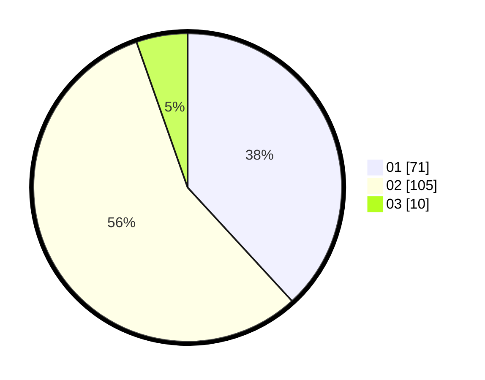

# Hasil

Hasil perolehan suara paslon dapat dilihat pada file paslon-01.txt, paslon-02.txt, dan paslon-03.txt.

Jika tidak ada, artinya data tersebut belum ada pada SIREKAP.

## Perolehan Suara

 * Paslon 01: **71**.
 * Paslon 02: **105**.
 * Paslon 03: **10**.

## Foto C Plano

https://sirekap-obj-formc.kpu.go.id/98d0/pemilu/ppwp/31/72/04/10/02/3172041002054-20240214-222006--5da20f01-a050-4764-96d4-a0f984bf38b6.jpg

https://sirekap-obj-formc.kpu.go.id/98d0/pemilu/ppwp/31/72/04/10/02/3172041002054-20240214-222028--f07cde4c-9725-47e8-a921-793573ce9448.jpg

https://sirekap-obj-formc.kpu.go.id/98d0/pemilu/ppwp/31/72/04/10/02/3172041002054-20240214-222033--4ecdac56-8609-4c36-9590-f3cb28ad8d63.jpg
