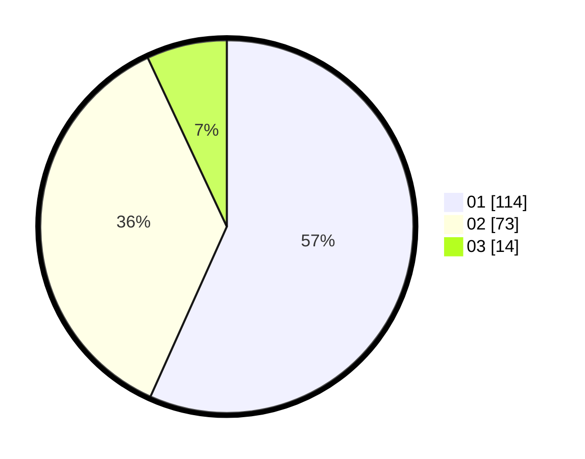

# Hasil

Hasil perolehan suara paslon dapat dilihat pada file paslon-01.txt, paslon-02.txt, dan paslon-03.txt.

Jika tidak ada, artinya data tersebut belum ada pada SIREKAP.

## Perolehan Suara

 * Paslon 01: **114**.
 * Paslon 02: **73**.
 * Paslon 03: **14**.

## Foto C Plano

https://sirekap-obj-formc.kpu.go.id/2381/pemilu/ppwp/31/72/04/10/02/3172041002060-20240215-185914--9565fbef-76f6-4238-926b-a07bd12ecc0f.jpg

https://sirekap-obj-formc.kpu.go.id/2381/pemilu/ppwp/31/72/04/10/02/3172041002060-20240214-215559--a1d4d4a6-807c-4ac6-a910-373ae42a7396.jpg

https://sirekap-obj-formc.kpu.go.id/2381/pemilu/ppwp/31/72/04/10/02/3172041002060-20240214-215141--4d89b0c6-5ac5-4a19-a07e-fb30c84979c7.jpg
