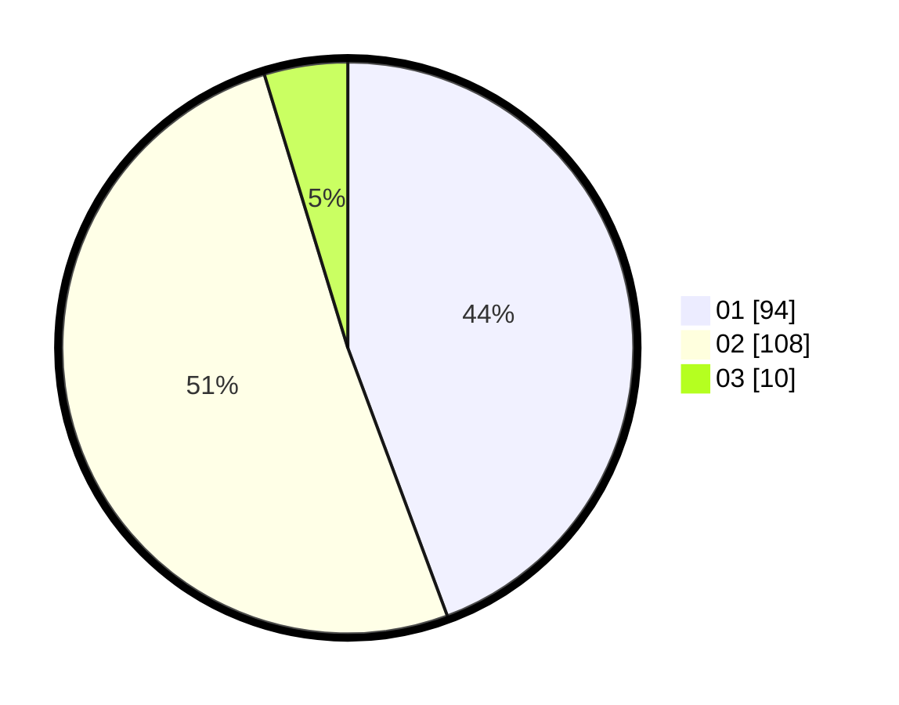

# Hasil

Hasil perolehan suara paslon dapat dilihat pada file paslon-01.txt, paslon-02.txt, dan paslon-03.txt.

Jika tidak ada, artinya data tersebut belum ada pada SIREKAP.

## Perolehan Suara

 * Paslon 01: **94**.
 * Paslon 02: **108**.
 * Paslon 03: **10**.

## Foto C Plano

https://sirekap-obj-formc.kpu.go.id/64d5/pemilu/ppwp/31/72/04/10/02/3172041002067-20240214-223919--e823977f-ebfa-4171-9b01-b5d014a1b200.jpg

https://sirekap-obj-formc.kpu.go.id/64d5/pemilu/ppwp/31/72/04/10/02/3172041002067-20240216-202411--e3acd735-8b0b-42df-a650-b5dc94559287.jpg

https://sirekap-obj-formc.kpu.go.id/64d5/pemilu/ppwp/31/72/04/10/02/3172041002067-20240214-224055--eeb00206-74e9-4cd0-a3c2-b951e4de0643.jpg

## DATA PEMILIH TETAP

Jumlah pemilih dalam DPT: **218**.
 * L: **114**.
 * P: **104**.

## DATA PENGGUNA HAK PILIH

Jumlah pengguna hak pilih dalam DPT: **215**.
 * L: **112**.
 * P: **103**.

Jumlah pengguna hak pilih dalam DPTb: **0**.
 * L: **0**.
 * P: **0**.

Jumlah pengguna hak pilih dalam DPK: **3**.
 * L: **2**.
 * P: **1**.

Jumlah pengguna hak pilih: **218**.
 * L: **114**.
 * P: **104**.

## JUMLAH SUARA SAH DAN TIDAK SAH

JUMLAH SELURUH SUARA SAH: **212**.

JUMLAH SUARA TIDAK SAH: **6**.

JUMLAH SELURUH SUARA SAH DAN SUARA TIDAK SAH: **218**.
