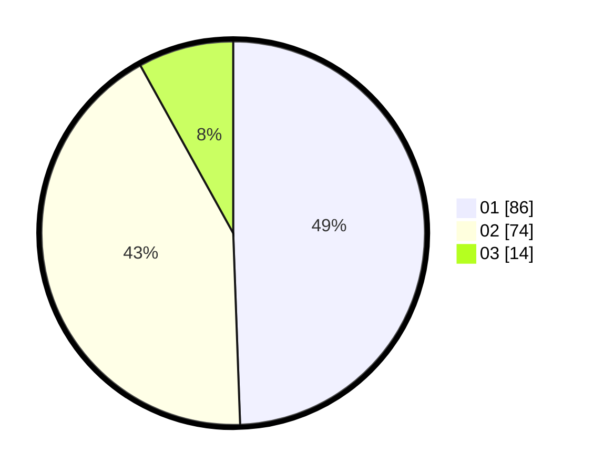

# Hasil

Hasil perolehan suara paslon dapat dilihat pada file paslon-01.txt, paslon-02.txt, dan paslon-03.txt.

Jika tidak ada, artinya data tersebut belum ada pada SIREKAP.

## Perolehan Suara

 * Paslon 01: **86**.
 * Paslon 02: **74**.
 * Paslon 03: **14**.

## Foto C Plano

https://sirekap-obj-formc.kpu.go.id/bfd7/pemilu/ppwp/31/72/04/10/02/3172041002081-20240214-231309--7f2216f4-5c3b-4eae-a7ff-6dc11416d9bb.jpg

https://sirekap-obj-formc.kpu.go.id/bfd7/pemilu/ppwp/31/72/04/10/02/3172041002081-20240214-231417--f2a9e540-fb00-4fcf-bbdf-b3f87b9652eb.jpg

https://sirekap-obj-formc.kpu.go.id/bfd7/pemilu/ppwp/31/72/04/10/02/3172041002081-20240214-231544--586c290c-eff7-477b-93b5-32ab37e81825.jpg
