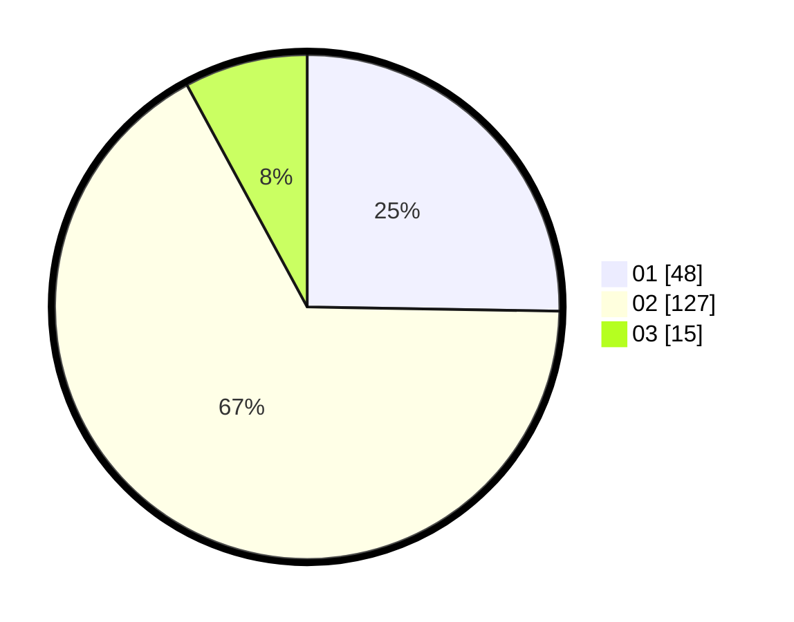

# Hasil

Hasil perolehan suara paslon dapat dilihat pada file paslon-01.txt, paslon-02.txt, dan paslon-03.txt.

Jika tidak ada, artinya data tersebut belum ada pada SIREKAP.

## Perolehan Suara

 * Paslon 01: **48**.
 * Paslon 02: **127**.
 * Paslon 03: **15**.

## Foto C Plano

https://sirekap-obj-formc.kpu.go.id/02d2/pemilu/ppwp/31/72/04/10/02/3172041002090-20240217-105940--6aacc0b4-db8a-4983-aaad-6cbb8f0b7746.jpg

https://sirekap-obj-formc.kpu.go.id/02d2/pemilu/ppwp/31/72/04/10/02/3172041002090-20240217-105555--e524b270-fb3c-434b-905f-065f32595811.jpg

https://sirekap-obj-formc.kpu.go.id/02d2/pemilu/ppwp/31/72/04/10/02/3172041002090-20240217-105658--77c6175d-cd7a-4399-aeb9-bb812e9593e5.jpg

## DATA PEMILIH TETAP

Jumlah pemilih dalam DPT: **291**.
 * L: **143**.
 * P: **148**.

## DATA PENGGUNA HAK PILIH

Jumlah pengguna hak pilih dalam DPT: **187**.
 * L: **92**.
 * P: **95**.

Jumlah pengguna hak pilih dalam DPTb: **0**.
 * L: **0**.
 * P: **0**.

Jumlah pengguna hak pilih dalam DPK: **2**.
 * L: **1**.
 * P: **1**.

Jumlah pengguna hak pilih: **189**.
 * L: **93**.
 * P: **96**.

## JUMLAH SUARA SAH DAN TIDAK SAH

JUMLAH SELURUH SUARA SAH: **187**.

JUMLAH SUARA TIDAK SAH: **2**.

JUMLAH SELURUH SUARA SAH DAN SUARA TIDAK SAH: **189**.
