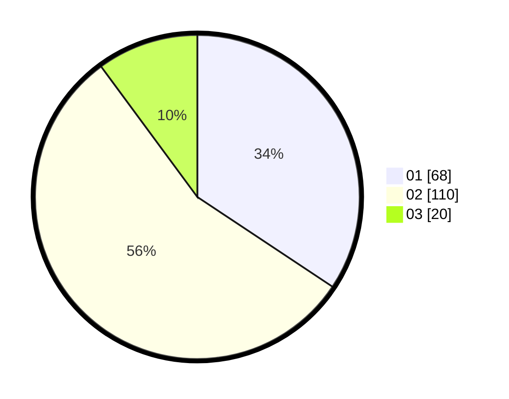

# Hasil

Hasil perolehan suara paslon dapat dilihat pada file paslon-01.txt, paslon-02.txt, dan paslon-03.txt.

Jika tidak ada, artinya data tersebut belum ada pada SIREKAP.

## Perolehan Suara

 * Paslon 01: **68**.
 * Paslon 02: **110**.
 * Paslon 03: **20**.

## Foto C Plano

https://sirekap-obj-formc.kpu.go.id/3838/pemilu/ppwp/31/72/04/10/02/3172041002092-20240214-155239--1f0efe85-8c65-4404-ab5e-4da1f9fdd78a.jpg

https://sirekap-obj-formc.kpu.go.id/3838/pemilu/ppwp/31/72/04/10/02/3172041002092-20240214-155202--d1e1caa0-a9eb-47ed-950d-6afaeadfa2cb.jpg

https://sirekap-obj-formc.kpu.go.id/3838/pemilu/ppwp/31/72/04/10/02/3172041002092-20240214-155117--3d52a391-b82b-477a-b586-604ee5c57ce7.jpg
