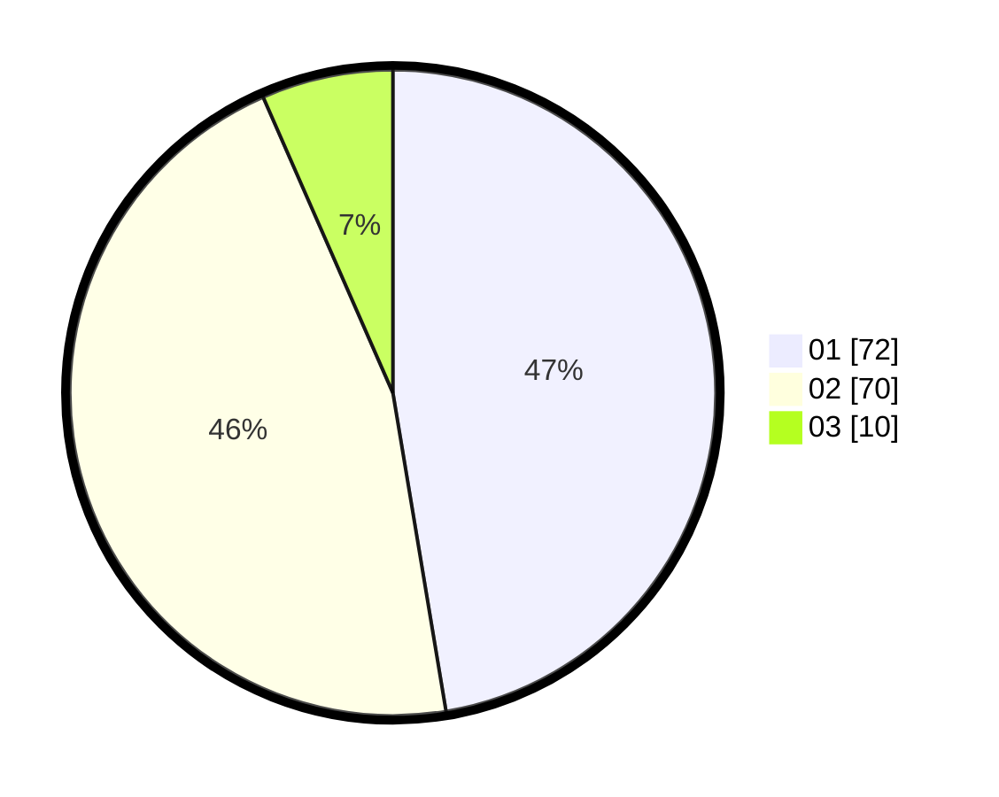

# Hasil

Hasil perolehan suara paslon dapat dilihat pada file paslon-01.txt, paslon-02.txt, dan paslon-03.txt.

Jika tidak ada, artinya data tersebut belum ada pada SIREKAP.

## Perolehan Suara

 * Paslon 01: **72**.
 * Paslon 02: **70**.
 * Paslon 03: **10**.

## Foto C Plano

https://sirekap-obj-formc.kpu.go.id/f1bb/pemilu/ppwp/31/72/04/10/02/3172041002104-20240214-211031--cbd89d15-f962-4592-bba5-31fe7ae02616.jpg

https://sirekap-obj-formc.kpu.go.id/f1bb/pemilu/ppwp/31/72/04/10/02/3172041002104-20240214-195544--840093c7-30f4-44d7-8390-176e1f58748a.jpg

https://sirekap-obj-formc.kpu.go.id/f1bb/pemilu/ppwp/31/72/04/10/02/3172041002104-20240214-210952--159589ed-1e5d-4bcd-9661-cbc3ce5805b0.jpg

## DATA PEMILIH TETAP

Jumlah pemilih dalam DPT: **202**.
 * L: **98**.
 * P: **104**.

## DATA PENGGUNA HAK PILIH

Jumlah pengguna hak pilih dalam DPT: **148**.
 * L: **69**.
 * P: **79**.

Jumlah pengguna hak pilih dalam DPTb: **1**.
 * L: **1**.
 * P: **0**.

Jumlah pengguna hak pilih dalam DPK: **4**.
 * L: **3**.
 * P: **1**.

Jumlah pengguna hak pilih: **153**.
 * L: **73**.
 * P: **80**.

## JUMLAH SUARA SAH DAN TIDAK SAH

JUMLAH SELURUH SUARA SAH: **152**.

JUMLAH SUARA TIDAK SAH: **1**.

JUMLAH SELURUH SUARA SAH DAN SUARA TIDAK SAH: **153**.
