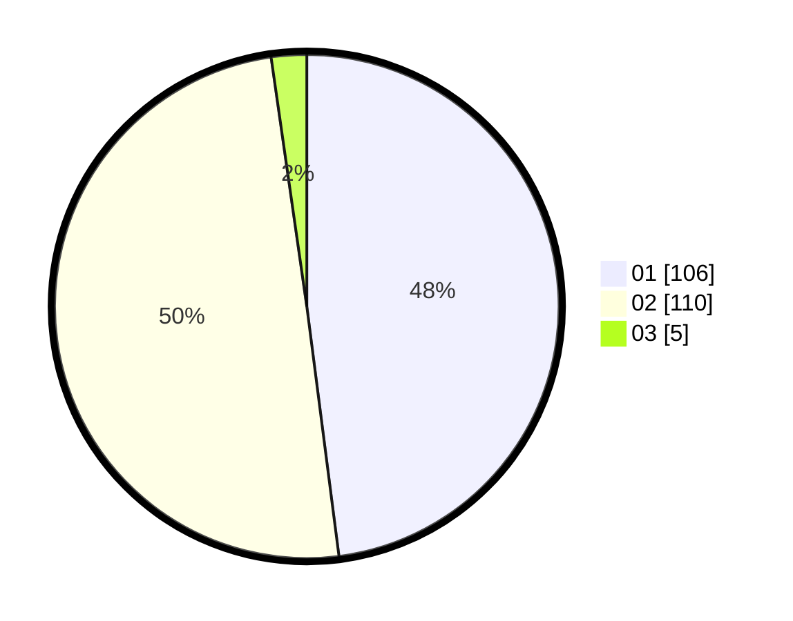

# Hasil

Hasil perolehan suara paslon dapat dilihat pada file paslon-01.txt, paslon-02.txt, dan paslon-03.txt.

Jika tidak ada, artinya data tersebut belum ada pada SIREKAP.

## Perolehan Suara

 * Paslon 01: **106**.
 * Paslon 02: **110**.
 * Paslon 03: **5**.

## Foto C Plano

https://sirekap-obj-formc.kpu.go.id/bb77/pemilu/ppwp/31/72/04/10/02/3172041002112-20240214-230907--3b899555-d3ff-49e7-b613-964990bddc61.jpg

https://sirekap-obj-formc.kpu.go.id/bb77/pemilu/ppwp/31/72/04/10/02/3172041002112-20240214-230913--dcd3045a-ccb4-4bce-a3c6-b0e392283668.jpg

https://sirekap-obj-formc.kpu.go.id/bb77/pemilu/ppwp/31/72/04/10/02/3172041002112-20240214-230916--eb215b4b-ef07-48c7-ae13-f171cf73c730.jpg

## DATA PEMILIH TETAP

Jumlah pemilih dalam DPT: **287**.
 * L: **142**.
 * P: **145**.

## DATA PENGGUNA HAK PILIH

Jumlah pengguna hak pilih dalam DPT: **222**.
 * L: **110**.
 * P: **112**.

Jumlah pengguna hak pilih dalam DPTb: **1**.
 * L: **1**.
 * P: **0**.

Jumlah pengguna hak pilih dalam DPK: **0**.
 * L: **0**.
 * P: **0**.

Jumlah pengguna hak pilih: **223**.
 * L: **111**.
 * P: **112**.

## JUMLAH SUARA SAH DAN TIDAK SAH

JUMLAH SELURUH SUARA SAH: **221**.

JUMLAH SUARA TIDAK SAH: **2**.

JUMLAH SELURUH SUARA SAH DAN SUARA TIDAK SAH: **223**.
