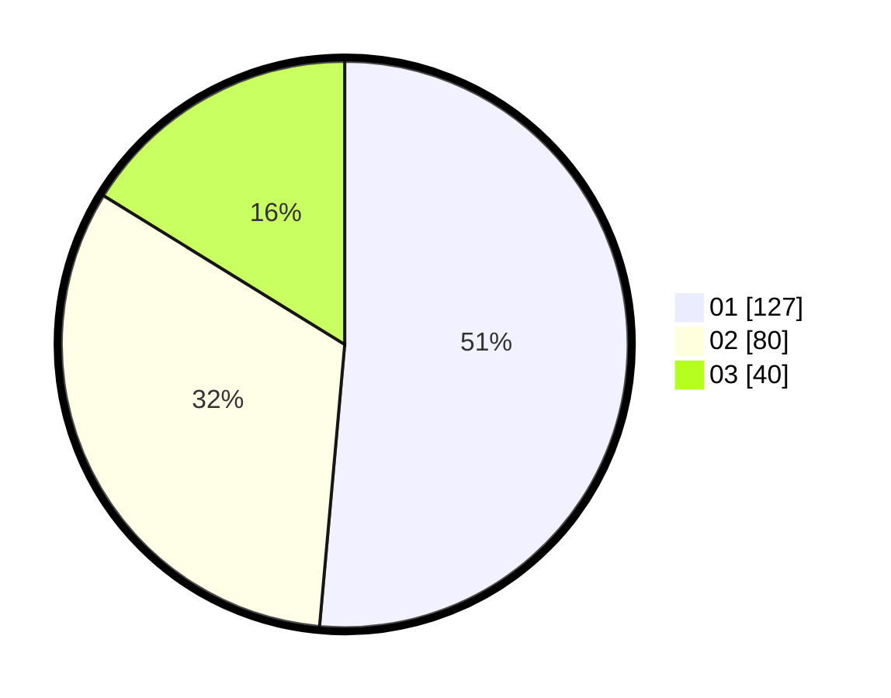

# Hasil

Hasil perolehan suara paslon dapat dilihat pada file paslon-01.txt, paslon-02.txt, dan paslon-03.txt.

Jika tidak ada, artinya data tersebut belum ada pada SIREKAP.

## Perolehan Suara

 * Paslon 01: **127**.
 * Paslon 02: **80**.
 * Paslon 03: **40**.

## Foto C Plano

https://sirekap-obj-formc.kpu.go.id/aeec/pemilu/ppwp/31/72/04/10/02/3172041002117-20240214-193914--213b6bd1-cb57-4b40-a645-3ff0cd7184f1.jpg

https://sirekap-obj-formc.kpu.go.id/aeec/pemilu/ppwp/31/72/04/10/02/3172041002117-20240214-194112--cd8989aa-b496-4bca-9e5d-5e124e455c63.jpg

https://sirekap-obj-formc.kpu.go.id/aeec/pemilu/ppwp/31/72/04/10/02/3172041002117-20240214-214158--ffba7086-7509-4502-a980-11e0291ae779.jpg

## DATA PEMILIH TETAP

Jumlah pemilih dalam DPT: **285**.
 * L: **133**.
 * P: **152**.

## DATA PENGGUNA HAK PILIH

Jumlah pengguna hak pilih dalam DPT: **235**.
 * L: **103**.
 * P: **132**.

Jumlah pengguna hak pilih dalam DPTb: **15**.
 * L: **3**.
 * P: **12**.

Jumlah pengguna hak pilih dalam DPK: **1**.
 * L: **0**.
 * P: **1**.

Jumlah pengguna hak pilih: **251**.
 * L: **106**.
 * P: **145**.

## JUMLAH SUARA SAH DAN TIDAK SAH

JUMLAH SELURUH SUARA SAH: **247**.

JUMLAH SUARA TIDAK SAH: **4**.

JUMLAH SELURUH SUARA SAH DAN SUARA TIDAK SAH: **251**.
