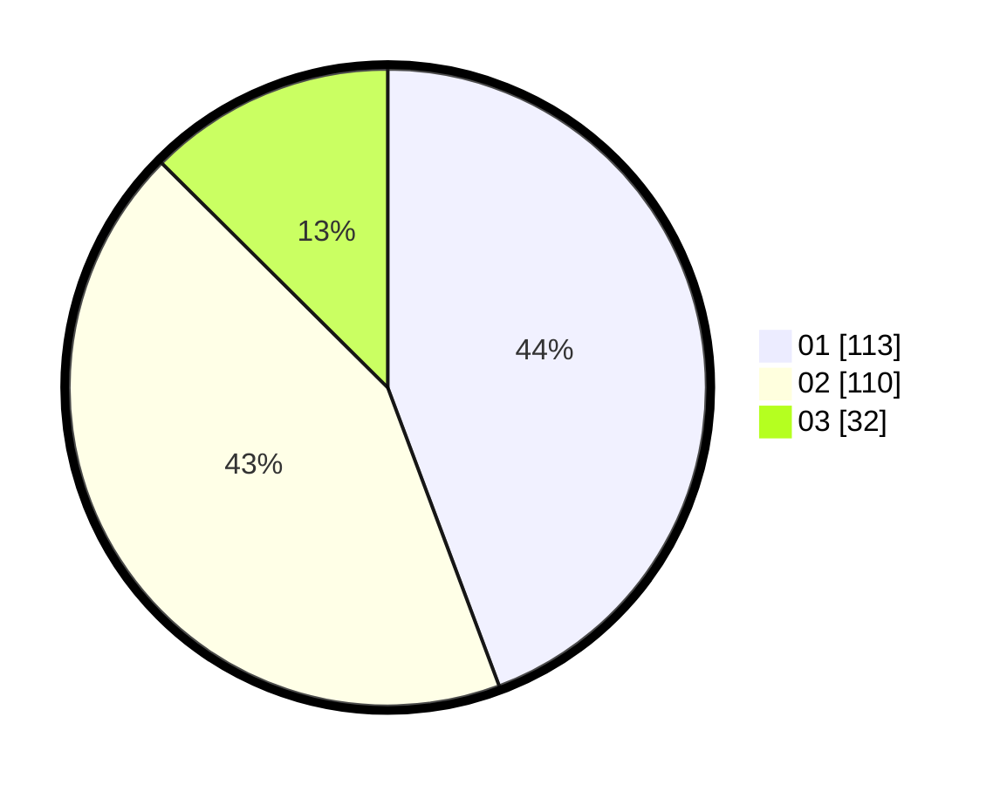

# Hasil

Hasil perolehan suara paslon dapat dilihat pada file paslon-01.txt, paslon-02.txt, dan paslon-03.txt.

Jika tidak ada, artinya data tersebut belum ada pada SIREKAP.

## Perolehan Suara

 * Paslon 01: **113**.
 * Paslon 02: **110**.
 * Paslon 03: **32**.

## Foto C Plano

https://sirekap-obj-formc.kpu.go.id/d48a/pemilu/ppwp/31/72/04/10/02/3172041002122-20240215-031544--3fe430ab-a210-4b97-b1f2-f2800be94a80.jpg

https://sirekap-obj-formc.kpu.go.id/d48a/pemilu/ppwp/31/72/04/10/02/3172041002122-20240215-031639--81aba265-e1af-4a09-a6ac-297acbce13ba.jpg

https://sirekap-obj-formc.kpu.go.id/d48a/pemilu/ppwp/31/72/04/10/02/3172041002122-20240215-031659--068b3f00-dd91-47f3-a8ba-c3b944699816.jpg

## DATA PEMILIH TETAP

Jumlah pemilih dalam DPT: **280**.
 * L: **132**.
 * P: **148**.

## DATA PENGGUNA HAK PILIH

Jumlah pengguna hak pilih dalam DPT: **229**.
 * L: **107**.
 * P: **122**.

Jumlah pengguna hak pilih dalam DPTb: **30**.
 * L: **0**.
 * P: **30**.

Jumlah pengguna hak pilih dalam DPK: **0**.
 * L: **0**.
 * P: **0**.

Jumlah pengguna hak pilih: **259**.
 * L: **107**.
 * P: **152**.

## JUMLAH SUARA SAH DAN TIDAK SAH

JUMLAH SELURUH SUARA SAH: **255**.

JUMLAH SUARA TIDAK SAH: **4**.

JUMLAH SELURUH SUARA SAH DAN SUARA TIDAK SAH: **259**.
