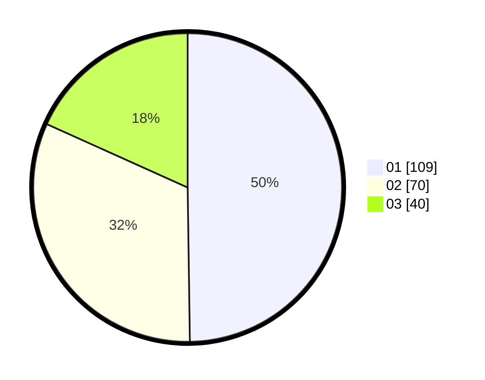

# Hasil

Hasil perolehan suara paslon dapat dilihat pada file paslon-01.txt, paslon-02.txt, dan paslon-03.txt.

Jika tidak ada, artinya data tersebut belum ada pada SIREKAP.

## Perolehan Suara

 * Paslon 01: **109**.
 * Paslon 02: **70**.
 * Paslon 03: **40**.

## Foto C Plano

https://sirekap-obj-formc.kpu.go.id/a28c/pemilu/ppwp/31/72/04/10/02/3172041002124-20240218-002845--8499bde3-4347-4b88-b4c5-fa082e10bb62.jpg

https://sirekap-obj-formc.kpu.go.id/a28c/pemilu/ppwp/31/72/04/10/02/3172041002124-20240218-003011--2efa1509-8a65-4f58-bdeb-62b3d09eabc1.jpg

https://sirekap-obj-formc.kpu.go.id/a28c/pemilu/ppwp/31/72/04/10/02/3172041002124-20240218-003659--989e559a-22bd-4a90-a8a4-ef41a85259a1.jpg

## DATA PEMILIH TETAP

Jumlah pemilih dalam DPT: **288**.
 * L: **137**.
 * P: **151**.

## DATA PENGGUNA HAK PILIH

Jumlah pengguna hak pilih dalam DPT: **214**.
 * L: **100**.
 * P: **114**.

Jumlah pengguna hak pilih dalam DPTb: **1**.
 * L: **0**.
 * P: **1**.

Jumlah pengguna hak pilih dalam DPK: **4**.
 * L: **2**.
 * P: **2**.

Jumlah pengguna hak pilih: **219**.
 * L: **102**.
 * P: **117**.

## JUMLAH SUARA SAH DAN TIDAK SAH

JUMLAH SELURUH SUARA SAH: **219**.

JUMLAH SUARA TIDAK SAH: **0**.

JUMLAH SELURUH SUARA SAH DAN SUARA TIDAK SAH: **219**.
