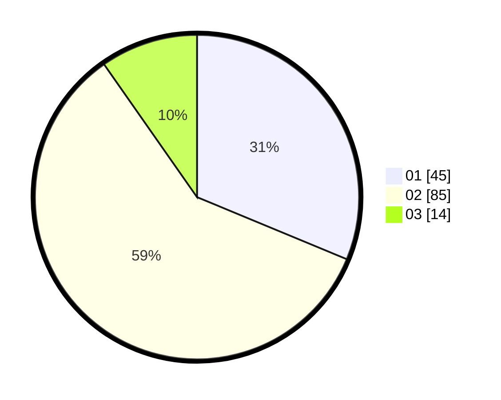

# Hasil

Hasil perolehan suara paslon dapat dilihat pada file paslon-01.txt, paslon-02.txt, dan paslon-03.txt.

Jika tidak ada, artinya data tersebut belum ada pada SIREKAP.

## Perolehan Suara

 * Paslon 01: **45**.
 * Paslon 02: **85**.
 * Paslon 03: **14**.

## Foto C Plano

https://sirekap-obj-formc.kpu.go.id/1ec4/pemilu/ppwp/31/72/04/10/02/3172041002129-20240216-022554--c2dae634-6160-4ed5-ac9c-13a18b758ac1.jpg

https://sirekap-obj-formc.kpu.go.id/1ec4/pemilu/ppwp/31/72/04/10/02/3172041002129-20240216-022613--af565e89-66f9-4890-b524-ea4fa56e562d.jpg

https://sirekap-obj-formc.kpu.go.id/1ec4/pemilu/ppwp/31/72/04/10/02/3172041002129-20240216-055852--f2823685-2149-4e1f-91f8-2d41332d3786.jpg

## DATA PEMILIH TETAP

Jumlah pemilih dalam DPT: **222**.
 * L: **107**.
 * P: **115**.

## DATA PENGGUNA HAK PILIH

Jumlah pengguna hak pilih dalam DPT: **144**.
 * L: **63**.
 * P: **81**.

Jumlah pengguna hak pilih dalam DPTb: **1**.
 * L: **1**.
 * P: **0**.

Jumlah pengguna hak pilih dalam DPK: **0**.
 * L: **0**.
 * P: **0**.

Jumlah pengguna hak pilih: **145**.
 * L: **64**.
 * P: **81**.

## JUMLAH SUARA SAH DAN TIDAK SAH

JUMLAH SELURUH SUARA SAH: **144**.

JUMLAH SUARA TIDAK SAH: **1**.

JUMLAH SELURUH SUARA SAH DAN SUARA TIDAK SAH: **145**.
