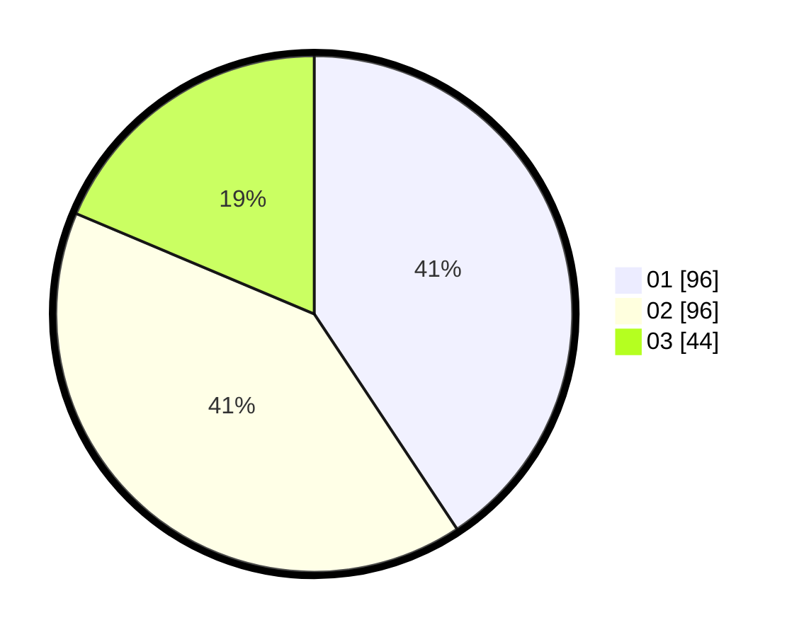

# Hasil

Hasil perolehan suara paslon dapat dilihat pada file paslon-01.txt, paslon-02.txt, dan paslon-03.txt.

Jika tidak ada, artinya data tersebut belum ada pada SIREKAP.

## Perolehan Suara

 * Paslon 01: **96**.
 * Paslon 02: **96**.
 * Paslon 03: **44**.

## Foto C Plano

https://sirekap-obj-formc.kpu.go.id/d87d/pemilu/ppwp/31/72/04/10/02/3172041002133-20240215-000004--ebe28d32-3b72-4e47-8d64-812e6116a12a.jpg

https://sirekap-obj-formc.kpu.go.id/d87d/pemilu/ppwp/31/72/04/10/02/3172041002133-20240214-205523--2b023ade-9483-439e-b810-92788e284d1f.jpg

https://sirekap-obj-formc.kpu.go.id/d87d/pemilu/ppwp/31/72/04/10/02/3172041002133-20240214-205607--1c6946ba-8b32-4ddd-9937-1248d03d01f0.jpg

## DATA PEMILIH TETAP

Jumlah pemilih dalam DPT: **285**.
 * L: **131**.
 * P: **154**.

## DATA PENGGUNA HAK PILIH

Jumlah pengguna hak pilih dalam DPT: **224**.
 * L: **98**.
 * P: **126**.

Jumlah pengguna hak pilih dalam DPTb: **14**.
 * L: **13**.
 * P: **1**.

Jumlah pengguna hak pilih dalam DPK: **1**.
 * L: **0**.
 * P: **1**.

Jumlah pengguna hak pilih: **239**.
 * L: **111**.
 * P: **128**.

## JUMLAH SUARA SAH DAN TIDAK SAH

JUMLAH SELURUH SUARA SAH: **236**.

JUMLAH SUARA TIDAK SAH: **3**.

JUMLAH SELURUH SUARA SAH DAN SUARA TIDAK SAH: **239**.
