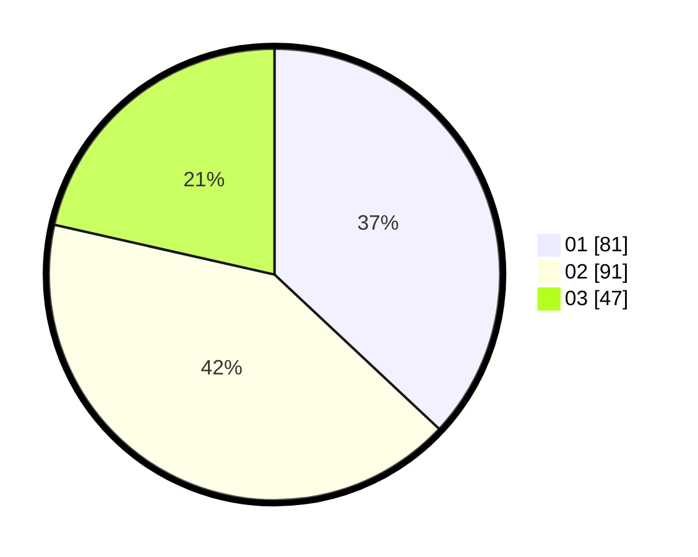

# Hasil

Hasil perolehan suara paslon dapat dilihat pada file paslon-01.txt, paslon-02.txt, dan paslon-03.txt.

Jika tidak ada, artinya data tersebut belum ada pada SIREKAP.

## Perolehan Suara

 * Paslon 01: **81**.
 * Paslon 02: **91**.
 * Paslon 03: **47**.

## Foto C Plano

https://sirekap-obj-formc.kpu.go.id/1023/pemilu/ppwp/31/72/04/10/02/3172041002137-20240214-155609--40d7856d-1a25-4b52-bd2c-f56398c23b8a.jpg

https://sirekap-obj-formc.kpu.go.id/1023/pemilu/ppwp/31/72/04/10/02/3172041002137-20240214-155252--8697dbf4-5060-4d0f-915f-5f4150371f86.jpg

https://sirekap-obj-formc.kpu.go.id/1023/pemilu/ppwp/31/72/04/10/02/3172041002137-20240214-160137--46b8b57c-bd36-499a-bb86-b7ace6f807aa.jpg
