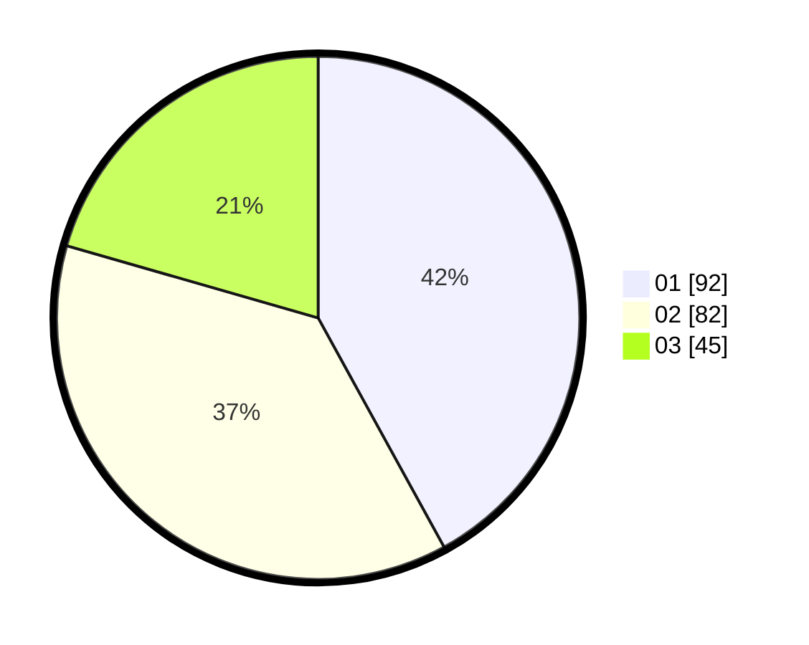

# Hasil

Hasil perolehan suara paslon dapat dilihat pada file paslon-01.txt, paslon-02.txt, dan paslon-03.txt.

Jika tidak ada, artinya data tersebut belum ada pada SIREKAP.

## Perolehan Suara

 * Paslon 01: **92**.
 * Paslon 02: **82**.
 * Paslon 03: **45**.

## Foto C Plano

https://sirekap-obj-formc.kpu.go.id/4239/pemilu/ppwp/31/72/04/10/02/3172041002141-20240214-222457--a49afda0-0686-4332-b3af-017480a1bdde.jpg

https://sirekap-obj-formc.kpu.go.id/4239/pemilu/ppwp/31/72/04/10/02/3172041002141-20240214-222307--cdac1934-de87-4437-a5b6-3f9e85f5c160.jpg

https://sirekap-obj-formc.kpu.go.id/4239/pemilu/ppwp/31/72/04/10/02/3172041002141-20240214-222735--b4f1fbe4-07b9-4d73-b21f-edbd0bc31fd5.jpg

## DATA PEMILIH TETAP

Jumlah pemilih dalam DPT: **281**.
 * L: **134**.
 * P: **147**.

## DATA PENGGUNA HAK PILIH

Jumlah pengguna hak pilih dalam DPT: **208**.
 * L: **96**.
 * P: **112**.

Jumlah pengguna hak pilih dalam DPTb: **13**.
 * L: **4**.
 * P: **9**.

Jumlah pengguna hak pilih dalam DPK: **2**.
 * L: **1**.
 * P: **1**.

Jumlah pengguna hak pilih: **223**.
 * L: **101**.
 * P: **122**.

## JUMLAH SUARA SAH DAN TIDAK SAH

JUMLAH SELURUH SUARA SAH: **219**.

JUMLAH SUARA TIDAK SAH: **4**.

JUMLAH SELURUH SUARA SAH DAN SUARA TIDAK SAH: **223**.
