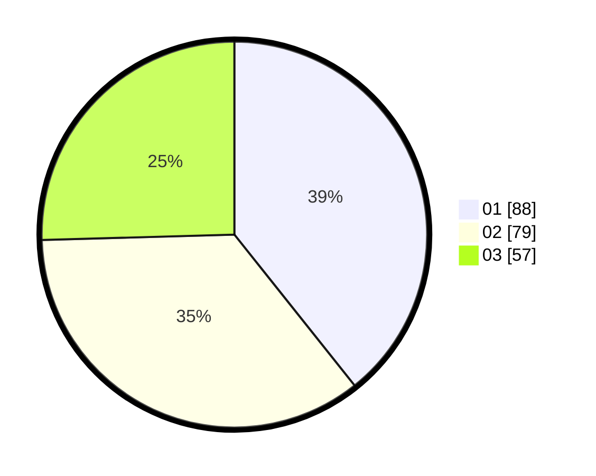

# Hasil

Hasil perolehan suara paslon dapat dilihat pada file paslon-01.txt, paslon-02.txt, dan paslon-03.txt.

Jika tidak ada, artinya data tersebut belum ada pada SIREKAP.

## Perolehan Suara

 * Paslon 01: **88**.
 * Paslon 02: **79**.
 * Paslon 03: **57**.

## Foto C Plano

https://sirekap-obj-formc.kpu.go.id/54ac/pemilu/ppwp/31/72/04/10/02/3172041002142-20240216-061419--14d9175e-f55c-4e23-b98d-4142654ce331.jpg

https://sirekap-obj-formc.kpu.go.id/54ac/pemilu/ppwp/31/72/04/10/02/3172041002142-20240216-061420--39d4bc66-55de-456c-9f78-7ddfe3bde493.jpg

https://sirekap-obj-formc.kpu.go.id/54ac/pemilu/ppwp/31/72/04/10/02/3172041002142-20240216-061419--44f9e3c3-71f8-4a26-8bed-bd3058ff4b75.jpg

## DATA PEMILIH TETAP

Jumlah pemilih dalam DPT: **225**.
 * L: **103**.
 * P: **122**.

## DATA PENGGUNA HAK PILIH

Jumlah pengguna hak pilih dalam DPT: **225**.
 * L: **103**.
 * P: **122**.

Jumlah pengguna hak pilih dalam DPTb: **2**.
 * L: **2**.
 * P: **0**.

Jumlah pengguna hak pilih dalam DPK: **1**.
 * L: **0**.
 * P: **1**.

Jumlah pengguna hak pilih: **228**.
 * L: **105**.
 * P: **123**.

## JUMLAH SUARA SAH DAN TIDAK SAH

JUMLAH SELURUH SUARA SAH: **224**.

JUMLAH SUARA TIDAK SAH: **4**.

JUMLAH SELURUH SUARA SAH DAN SUARA TIDAK SAH: **228**.
