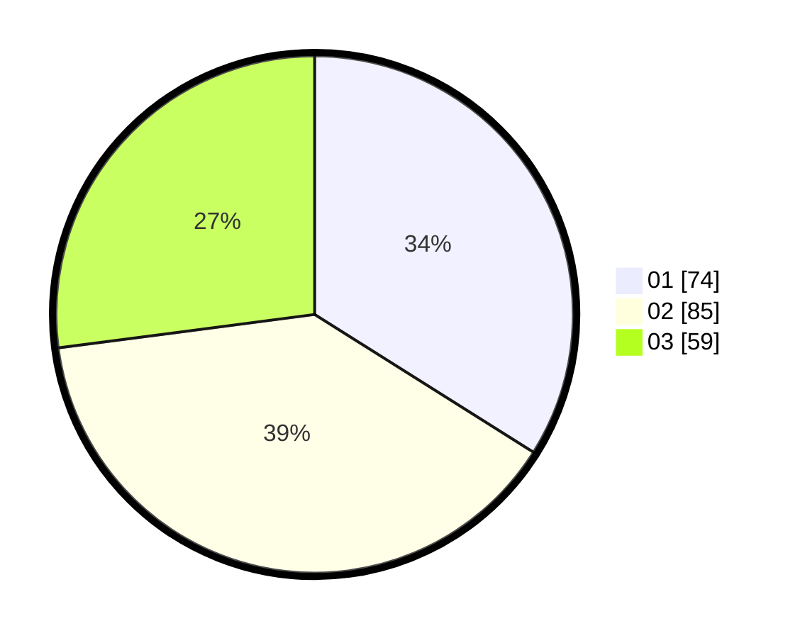

# Hasil

Hasil perolehan suara paslon dapat dilihat pada file paslon-01.txt, paslon-02.txt, dan paslon-03.txt.

Jika tidak ada, artinya data tersebut belum ada pada SIREKAP.

## Perolehan Suara

 * Paslon 01: **74**.
 * Paslon 02: **85**.
 * Paslon 03: **59**.

## Foto C Plano

https://sirekap-obj-formc.kpu.go.id/59ba/pemilu/ppwp/31/72/04/10/02/3172041002144-20240214-155324--7562d9d4-ca4a-4948-8940-22ef83b89a6f.jpg

https://sirekap-obj-formc.kpu.go.id/59ba/pemilu/ppwp/31/72/04/10/02/3172041002144-20240214-155412--1b27c88a-0264-4cf1-a174-bbe3135bfcbb.jpg

https://sirekap-obj-formc.kpu.go.id/59ba/pemilu/ppwp/31/72/04/10/02/3172041002144-20240214-155304--3a7d565a-8d2f-42b8-afd3-fa0f7c78ba6b.jpg

## DATA PEMILIH TETAP

Jumlah pemilih dalam DPT: **294**.
 * L: **137**.
 * P: **157**.

## DATA PENGGUNA HAK PILIH

Jumlah pengguna hak pilih dalam DPT: **217**.
 * L: **105**.
 * P: **112**.

Jumlah pengguna hak pilih dalam DPTb: **1**.
 * L: **0**.
 * P: **1**.

Jumlah pengguna hak pilih dalam DPK: **1**.
 * L: **0**.
 * P: **1**.

Jumlah pengguna hak pilih: **219**.
 * L: **105**.
 * P: **114**.

## JUMLAH SUARA SAH DAN TIDAK SAH

JUMLAH SELURUH SUARA SAH: **218**.

JUMLAH SUARA TIDAK SAH: **1**.

JUMLAH SELURUH SUARA SAH DAN SUARA TIDAK SAH: **219**.
