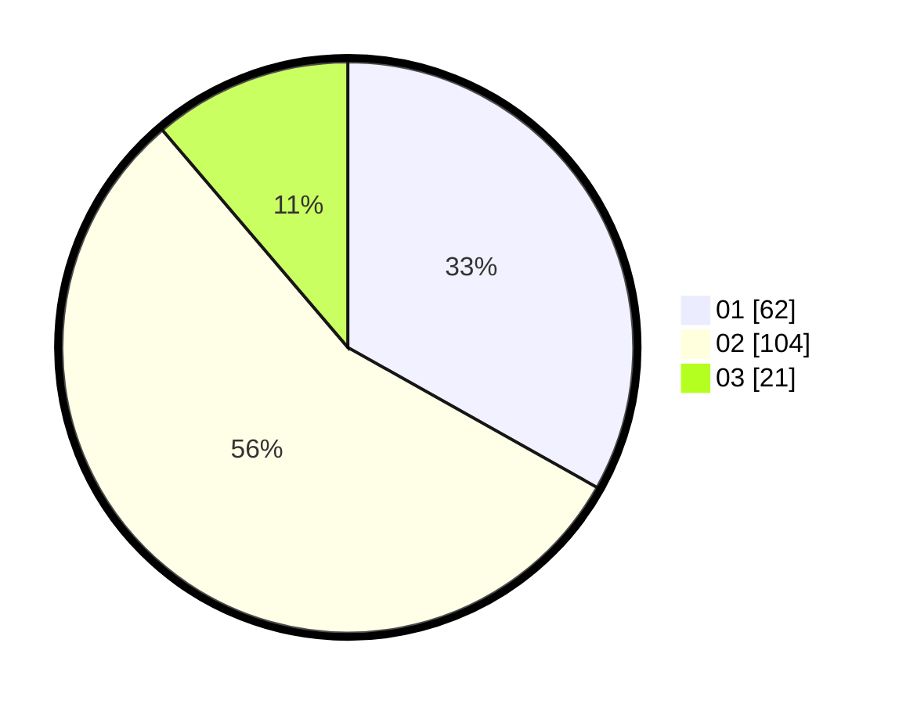

# Hasil

Hasil perolehan suara paslon dapat dilihat pada file paslon-01.txt, paslon-02.txt, dan paslon-03.txt.

Jika tidak ada, artinya data tersebut belum ada pada SIREKAP.

## Perolehan Suara

 * Paslon 01: **62**.
 * Paslon 02: **104**.
 * Paslon 03: **21**.

## Foto C Plano

https://sirekap-obj-formc.kpu.go.id/c386/pemilu/ppwp/31/72/04/10/02/3172041002166-20240214-192547--c0f2806f-e3bc-40fe-8dd8-f0c368afb048.jpg

https://sirekap-obj-formc.kpu.go.id/c386/pemilu/ppwp/31/72/04/10/02/3172041002166-20240214-192538--a307cb23-f17d-4aea-abbb-0c1b0fdbd287.jpg

https://sirekap-obj-formc.kpu.go.id/c386/pemilu/ppwp/31/72/04/10/02/3172041002166-20240214-193241--568aaea0-8c44-469e-bdbc-885f7daea1e3.jpg

## DATA PEMILIH TETAP

Jumlah pemilih dalam DPT: **290**.
 * L: **140**.
 * P: **150**.

## DATA PENGGUNA HAK PILIH

Jumlah pengguna hak pilih dalam DPT: **190**.
 * L: **92**.
 * P: **98**.

Jumlah pengguna hak pilih dalam DPTb: **0**.
 * L: **0**.
 * P: **0**.

Jumlah pengguna hak pilih dalam DPK: **0**.
 * L: **0**.
 * P: **0**.

Jumlah pengguna hak pilih: **190**.
 * L: **92**.
 * P: **98**.

## JUMLAH SUARA SAH DAN TIDAK SAH

JUMLAH SELURUH SUARA SAH: **187**.

JUMLAH SUARA TIDAK SAH: **3**.

JUMLAH SELURUH SUARA SAH DAN SUARA TIDAK SAH: **190**.
