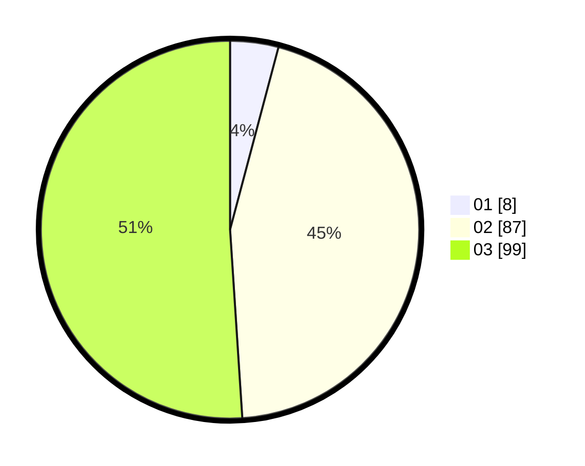

# Hasil

Hasil perolehan suara paslon dapat dilihat pada file paslon-01.txt, paslon-02.txt, dan paslon-03.txt.

Jika tidak ada, artinya data tersebut belum ada pada SIREKAP.

## Perolehan Suara

 * Paslon 01: **8**.
 * Paslon 02: **87**.
 * Paslon 03: **99**.

## Foto C Plano

https://sirekap-obj-formc.kpu.go.id/04fa/pemilu/ppwp/31/72/04/10/02/3172041002171-20240214-184739--61fb8f7f-b31f-430b-add7-f7e17d28a368.jpg

https://sirekap-obj-formc.kpu.go.id/04fa/pemilu/ppwp/31/72/04/10/02/3172041002171-20240214-184854--47189be2-ea46-44e4-8cb4-048862599dfd.jpg

https://sirekap-obj-formc.kpu.go.id/04fa/pemilu/ppwp/31/72/04/10/02/3172041002171-20240214-184857--ba9818a8-1be2-4d6f-b4bf-41a9d5df5657.jpg

## DATA PEMILIH TETAP

Jumlah pemilih dalam DPT: **203**.
 * L: **97**.
 * P: **106**.

## DATA PENGGUNA HAK PILIH

Jumlah pengguna hak pilih dalam DPT: **164**.
 * L: **78**.
 * P: **86**.

Jumlah pengguna hak pilih dalam DPTb: **17**.
 * L: **6**.
 * P: **11**.

Jumlah pengguna hak pilih dalam DPK: **13**.
 * L: **6**.
 * P: **7**.

Jumlah pengguna hak pilih: **194**.
 * L: **90**.
 * P: **104**.

## JUMLAH SUARA SAH DAN TIDAK SAH

JUMLAH SELURUH SUARA SAH: **194**.

JUMLAH SUARA TIDAK SAH: **0**.

JUMLAH SELURUH SUARA SAH DAN SUARA TIDAK SAH: **0**.
