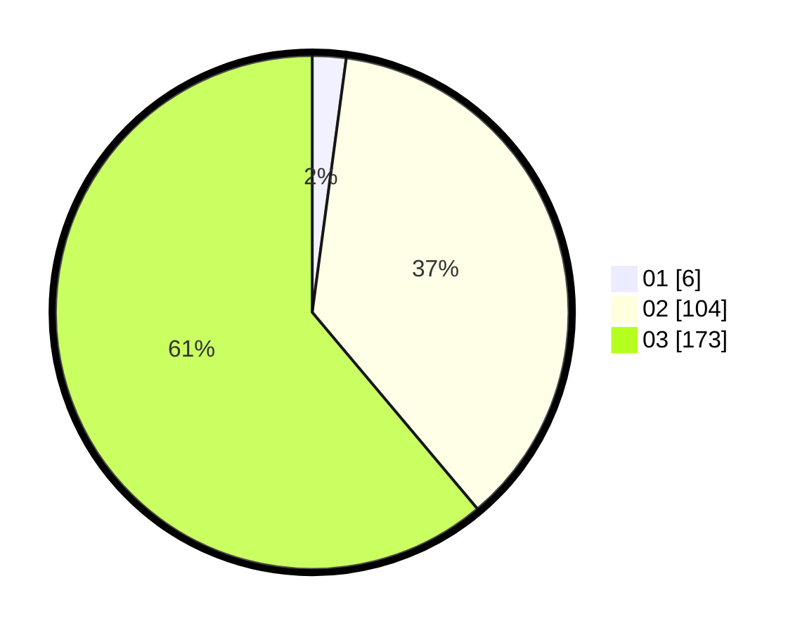

# Hasil

Hasil perolehan suara paslon dapat dilihat pada file paslon-01.txt, paslon-02.txt, dan paslon-03.txt.

Jika tidak ada, artinya data tersebut belum ada pada SIREKAP.

## Perolehan Suara

 * Paslon 01: **6**.
 * Paslon 02: **104**.
 * Paslon 03: **173**.

## Foto C Plano

https://sirekap-obj-formc.kpu.go.id/5121/pemilu/ppwp/31/72/04/10/02/3172041002172-20240214-200150--e9bbfcdd-968c-4907-89d7-21ed3e9363bc.jpg

https://sirekap-obj-formc.kpu.go.id/5121/pemilu/ppwp/31/72/04/10/02/3172041002172-20240214-192759--fe229a47-da8c-4ca3-911b-1a5a2ad62a22.jpg

https://sirekap-obj-formc.kpu.go.id/5121/pemilu/ppwp/31/72/04/10/02/3172041002172-20240214-192814--4e536d0f-8378-49d4-938a-924b304b8635.jpg

## DATA PEMILIH TETAP

Jumlah pemilih dalam DPT: **200**.
 * L: **109**.
 * P: **91**.

## DATA PENGGUNA HAK PILIH

Jumlah pengguna hak pilih dalam DPT: **159**.
 * L: **85**.
 * P: **74**.

Jumlah pengguna hak pilih dalam DPTb: **11**.
 * L: **5**.
 * P: **6**.

Jumlah pengguna hak pilih dalam DPK: **16**.
 * L: **7**.
 * P: **9**.

Jumlah pengguna hak pilih: **186**.
 * L: **97**.
 * P: **89**.

## JUMLAH SUARA SAH DAN TIDAK SAH

JUMLAH SELURUH SUARA SAH: **183**.

JUMLAH SUARA TIDAK SAH: **3**.

JUMLAH SELURUH SUARA SAH DAN SUARA TIDAK SAH: **186**.
