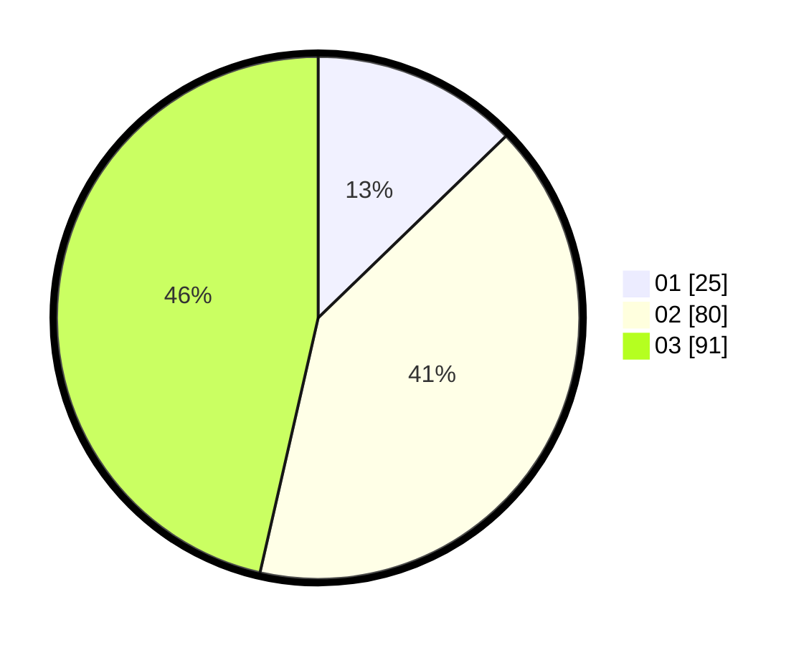

# Hasil

Hasil perolehan suara paslon dapat dilihat pada file paslon-01.txt, paslon-02.txt, dan paslon-03.txt.

Jika tidak ada, artinya data tersebut belum ada pada SIREKAP.

## Perolehan Suara

 * Paslon 01: **25**.
 * Paslon 02: **80**.
 * Paslon 03: **91**.

## Foto C Plano

https://sirekap-obj-formc.kpu.go.id/45a0/pemilu/ppwp/31/72/04/10/02/3172041002173-20240214-155727--99ec4916-a4ee-423b-ab6d-366c5a8cc423.jpg

https://sirekap-obj-formc.kpu.go.id/45a0/pemilu/ppwp/31/72/04/10/02/3172041002173-20240214-185922--adeead44-f235-4041-b40b-637862818e25.jpg

https://sirekap-obj-formc.kpu.go.id/45a0/pemilu/ppwp/31/72/04/10/02/3172041002173-20240214-185719--8a8eb0a2-3c40-4173-8c55-d5f41499e0c6.jpg

## DATA PEMILIH TETAP

Jumlah pemilih dalam DPT: **286**.
 * L: **132**.
 * P: **154**.

## DATA PENGGUNA HAK PILIH

Jumlah pengguna hak pilih dalam DPT: **179**.
 * L: **80**.
 * P: **99**.

Jumlah pengguna hak pilih dalam DPTb: **13**.
 * L: **6**.
 * P: **7**.

Jumlah pengguna hak pilih dalam DPK: **8**.
 * L: **3**.
 * P: **5**.

Jumlah pengguna hak pilih: **200**.
 * L: **89**.
 * P: **111**.

## JUMLAH SUARA SAH DAN TIDAK SAH

JUMLAH SELURUH SUARA SAH: **196**.

JUMLAH SUARA TIDAK SAH: **4**.

JUMLAH SELURUH SUARA SAH DAN SUARA TIDAK SAH: **200**.
