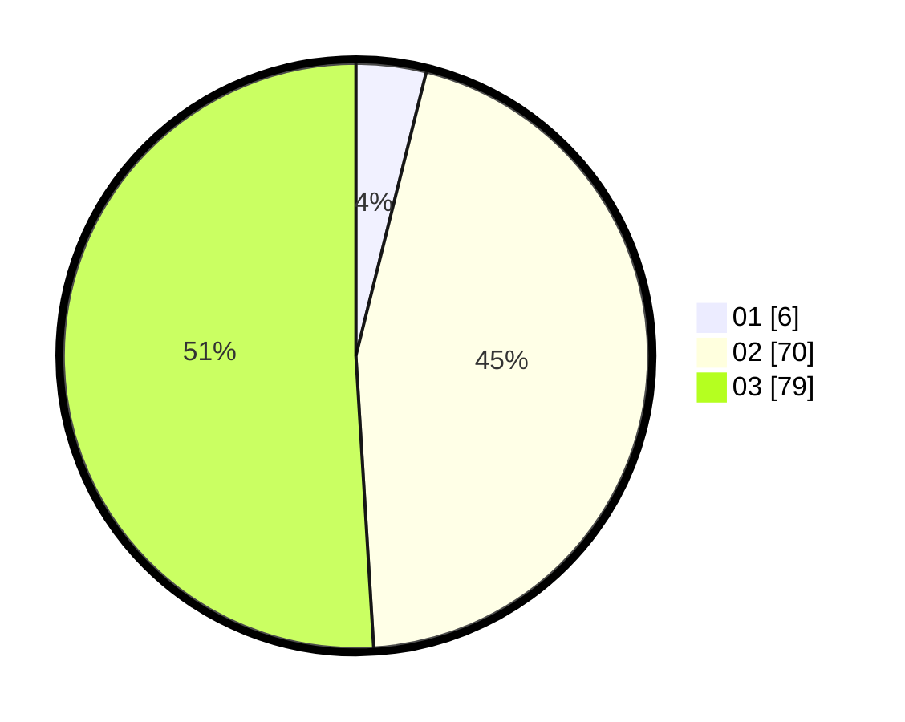

# Hasil

Hasil perolehan suara paslon dapat dilihat pada file paslon-01.txt, paslon-02.txt, dan paslon-03.txt.

Jika tidak ada, artinya data tersebut belum ada pada SIREKAP.

## Perolehan Suara

 * Paslon 01: **6**.
 * Paslon 02: **70**.
 * Paslon 03: **79**.

## Foto C Plano

https://sirekap-obj-formc.kpu.go.id/f084/pemilu/ppwp/31/72/04/10/02/3172041002176-20240214-212005--6d443e47-0ee7-4f02-a852-2748ec73aa17.jpg

https://sirekap-obj-formc.kpu.go.id/f084/pemilu/ppwp/31/72/04/10/02/3172041002176-20240214-212052--f7442a93-5a27-4f42-a143-a05248d41094.jpg

https://sirekap-obj-formc.kpu.go.id/f084/pemilu/ppwp/31/72/04/10/02/3172041002176-20240214-205953--b2d20155-2ded-492b-9094-1948c1855302.jpg
