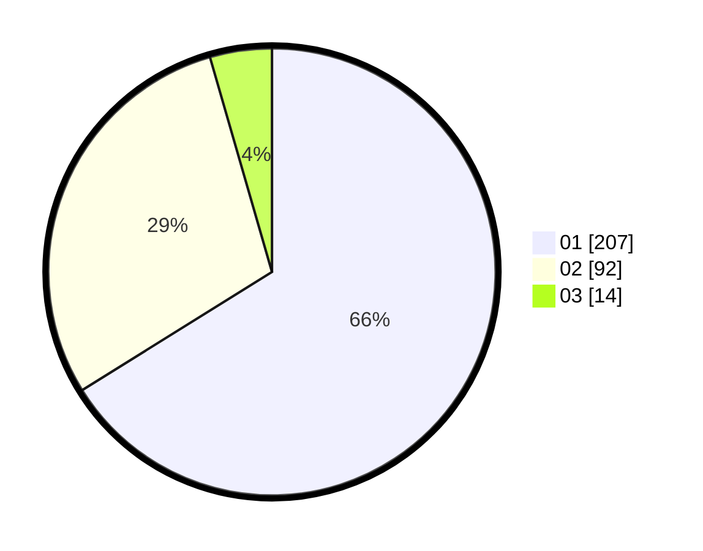

# Hasil

Hasil perolehan suara paslon dapat dilihat pada file paslon-01.txt, paslon-02.txt, dan paslon-03.txt.

Jika tidak ada, artinya data tersebut belum ada pada SIREKAP.

## Perolehan Suara

 * Paslon 01: **207**.
 * Paslon 02: **92**.
 * Paslon 03: **14**.

## Foto C Plano

https://sirekap-obj-formc.kpu.go.id/a678/pemilu/ppwp/31/72/04/10/03/3172041003001-20240216-153225--062b02ee-d760-4e4a-8030-e858bce68dce.jpg

https://sirekap-obj-formc.kpu.go.id/a678/pemilu/ppwp/31/72/04/10/03/3172041003001-20240216-152218--ec279ddf-8242-4c7b-8357-0bdf984e7333.jpg

https://sirekap-obj-formc.kpu.go.id/a678/pemilu/ppwp/31/72/04/10/03/3172041003001-20240216-151417--82216325-e6a9-4862-aadf-d9f378fcd67d.jpg
