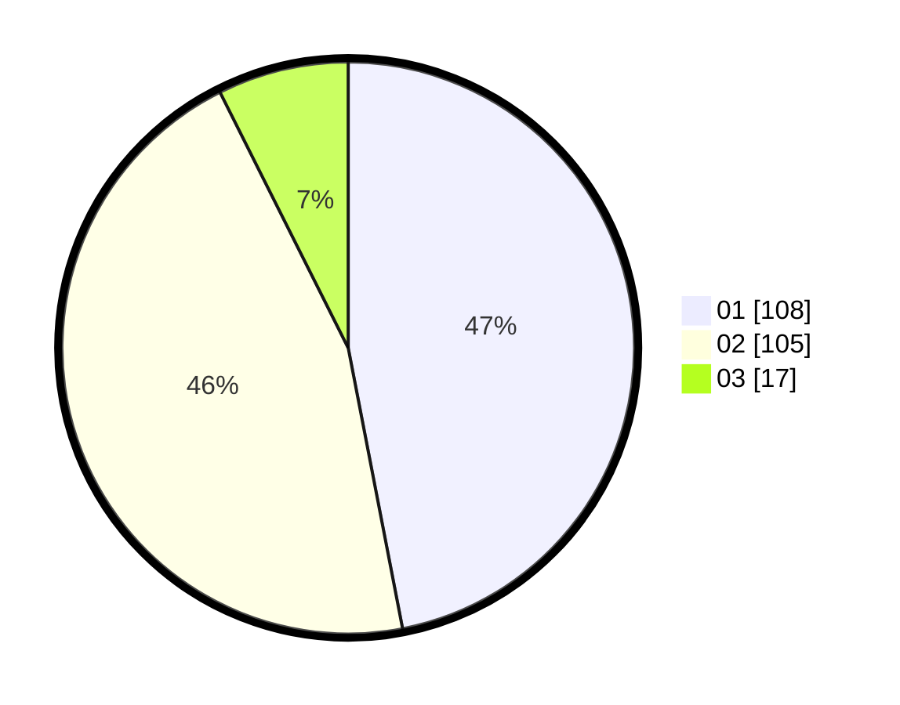

# Hasil

Hasil perolehan suara paslon dapat dilihat pada file paslon-01.txt, paslon-02.txt, dan paslon-03.txt.

Jika tidak ada, artinya data tersebut belum ada pada SIREKAP.

## Perolehan Suara

 * Paslon 01: **108**.
 * Paslon 02: **105**.
 * Paslon 03: **17**.

## Foto C Plano

https://sirekap-obj-formc.kpu.go.id/9e0a/pemilu/ppwp/31/72/04/10/03/3172041003004-20240214-185841--4176f66c-7797-4cff-91a7-514781fcf691.jpg

https://sirekap-obj-formc.kpu.go.id/9e0a/pemilu/ppwp/31/72/04/10/03/3172041003004-20240214-185728--7c85bbc0-9d87-47bd-aa11-b27422c476f1.jpg

https://sirekap-obj-formc.kpu.go.id/9e0a/pemilu/ppwp/31/72/04/10/03/3172041003004-20240214-185524--f8126198-a064-4893-abc0-b8e70d34fb98.jpg

## DATA PEMILIH TETAP

Jumlah pemilih dalam DPT: **290**.
 * L: **148**.
 * P: **142**.

## DATA PENGGUNA HAK PILIH

Jumlah pengguna hak pilih dalam DPT: **234**.
 * L: **115**.
 * P: **119**.

Jumlah pengguna hak pilih dalam DPTb: **0**.
 * L: **0**.
 * P: **0**.

Jumlah pengguna hak pilih dalam DPK: **0**.
 * L: **0**.
 * P: **0**.

Jumlah pengguna hak pilih: **234**.
 * L: **115**.
 * P: **119**.

## JUMLAH SUARA SAH DAN TIDAK SAH

JUMLAH SELURUH SUARA SAH: **230**.

JUMLAH SUARA TIDAK SAH: **4**.

JUMLAH SELURUH SUARA SAH DAN SUARA TIDAK SAH: **234**.
