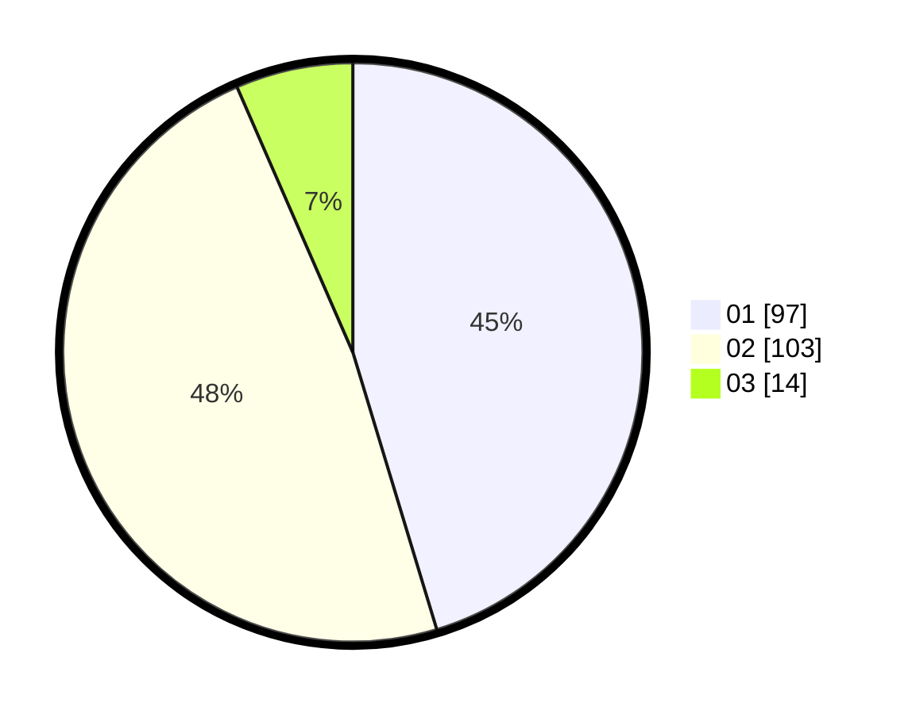

# Hasil

Hasil perolehan suara paslon dapat dilihat pada file paslon-01.txt, paslon-02.txt, dan paslon-03.txt.

Jika tidak ada, artinya data tersebut belum ada pada SIREKAP.

## Perolehan Suara

 * Paslon 01: **97**.
 * Paslon 02: **103**.
 * Paslon 03: **14**.

## Foto C Plano

https://sirekap-obj-formc.kpu.go.id/9afb/pemilu/ppwp/31/72/04/10/03/3172041003006-20240216-135522--c3550dab-3efd-41dc-acb9-f0165ba4b002.jpg

https://sirekap-obj-formc.kpu.go.id/9afb/pemilu/ppwp/31/72/04/10/03/3172041003006-20240216-135523--a867c397-3766-4ca3-830e-b73db82c2849.jpg

https://sirekap-obj-formc.kpu.go.id/9afb/pemilu/ppwp/31/72/04/10/03/3172041003006-20240216-135523--fb6a2c56-14e5-49cb-a717-0b6cb5e44932.jpg

## DATA PEMILIH TETAP

Jumlah pemilih dalam DPT: **289**.
 * L: **152**.
 * P: **137**.

## DATA PENGGUNA HAK PILIH

Jumlah pengguna hak pilih dalam DPT: **222**.
 * L: **109**.
 * P: **113**.

Jumlah pengguna hak pilih dalam DPTb: **0**.
 * L: **0**.
 * P: **0**.

Jumlah pengguna hak pilih dalam DPK: **5**.
 * L: **3**.
 * P: **2**.

Jumlah pengguna hak pilih: **227**.
 * L: **112**.
 * P: **115**.

## JUMLAH SUARA SAH DAN TIDAK SAH

JUMLAH SELURUH SUARA SAH: **214**.

JUMLAH SUARA TIDAK SAH: **13**.

JUMLAH SELURUH SUARA SAH DAN SUARA TIDAK SAH: **227**.
