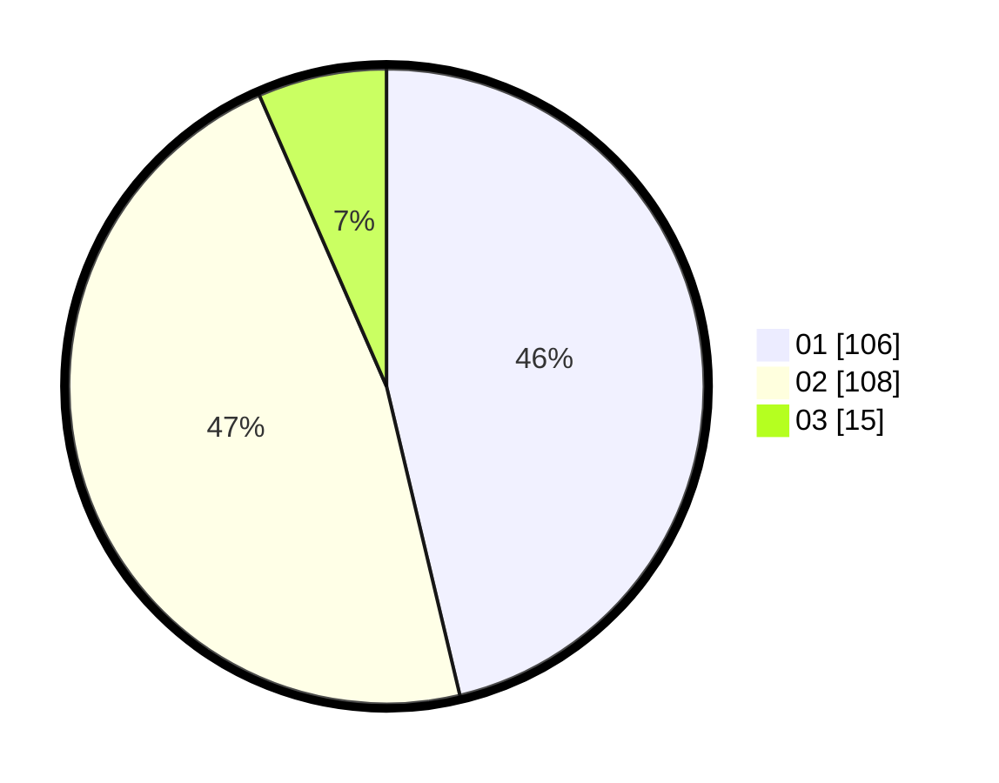

# Hasil

Hasil perolehan suara paslon dapat dilihat pada file paslon-01.txt, paslon-02.txt, dan paslon-03.txt.

Jika tidak ada, artinya data tersebut belum ada pada SIREKAP.

## Perolehan Suara

 * Paslon 01: **106**.
 * Paslon 02: **108**.
 * Paslon 03: **15**.

## Foto C Plano

https://sirekap-obj-formc.kpu.go.id/076a/pemilu/ppwp/31/72/04/10/03/3172041003007-20240214-190642--2c1db486-9673-429b-a4f6-d2ee2967b8ce.jpg

https://sirekap-obj-formc.kpu.go.id/076a/pemilu/ppwp/31/72/04/10/03/3172041003007-20240214-190653--58cafb4d-939b-45a9-801b-25a3fbee5355.jpg

https://sirekap-obj-formc.kpu.go.id/076a/pemilu/ppwp/31/72/04/10/03/3172041003007-20240214-190659--8a7ff83b-fbb0-4f99-944a-c4f60c428ee2.jpg

## DATA PEMILIH TETAP

Jumlah pemilih dalam DPT: **288**.
 * L: **147**.
 * P: **141**.

## DATA PENGGUNA HAK PILIH

Jumlah pengguna hak pilih dalam DPT: **228**.
 * L: **110**.
 * P: **118**.

Jumlah pengguna hak pilih dalam DPTb: **1**.
 * L: **1**.
 * P: **0**.

Jumlah pengguna hak pilih dalam DPK: **3**.
 * L: **2**.
 * P: **1**.

Jumlah pengguna hak pilih: **232**.
 * L: **113**.
 * P: **119**.

## JUMLAH SUARA SAH DAN TIDAK SAH

JUMLAH SELURUH SUARA SAH: **229**.

JUMLAH SUARA TIDAK SAH: **3**.

JUMLAH SELURUH SUARA SAH DAN SUARA TIDAK SAH: **232**.
