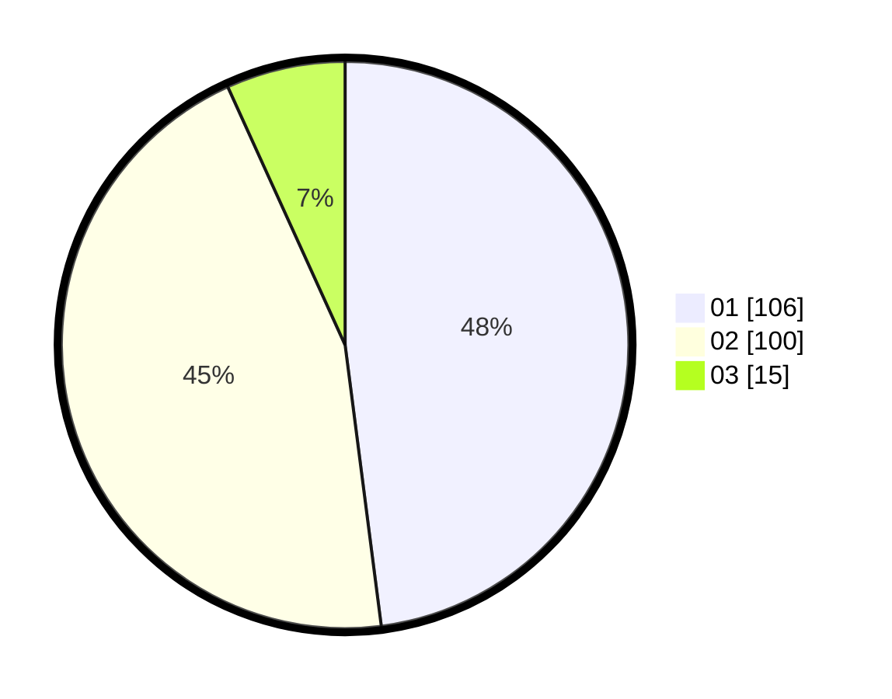

# Hasil

Hasil perolehan suara paslon dapat dilihat pada file paslon-01.txt, paslon-02.txt, dan paslon-03.txt.

Jika tidak ada, artinya data tersebut belum ada pada SIREKAP.

## Perolehan Suara

 * Paslon 01: **106**.
 * Paslon 02: **100**.
 * Paslon 03: **15**.

## Foto C Plano

https://sirekap-obj-formc.kpu.go.id/b687/pemilu/ppwp/31/72/04/10/03/3172041003012-20240215-070639--cedcc251-4387-4f95-a26c-5c96bf9269bf.jpg

https://sirekap-obj-formc.kpu.go.id/b687/pemilu/ppwp/31/72/04/10/03/3172041003012-20240215-041157--93eb1a46-b749-4fac-97ca-1986d83d78f8.jpg

https://sirekap-obj-formc.kpu.go.id/b687/pemilu/ppwp/31/72/04/10/03/3172041003012-20240214-190747--301bae1d-9d36-4de5-ade6-f20911f4871d.jpg

## DATA PEMILIH TETAP

Jumlah pemilih dalam DPT: **298**.
 * L: **152**.
 * P: **146**.

## DATA PENGGUNA HAK PILIH

Jumlah pengguna hak pilih dalam DPT: **211**.
 * L: **105**.
 * P: **106**.

Jumlah pengguna hak pilih dalam DPTb: **6**.
 * L: **2**.
 * P: **4**.

Jumlah pengguna hak pilih dalam DPK: **2**.
 * L: **1**.
 * P: **1**.

Jumlah pengguna hak pilih: **219**.
 * L: **108**.
 * P: **111**.

## JUMLAH SUARA SAH DAN TIDAK SAH

JUMLAH SELURUH SUARA SAH: **221**.

JUMLAH SUARA TIDAK SAH: **1**.

JUMLAH SELURUH SUARA SAH DAN SUARA TIDAK SAH: **222**.
