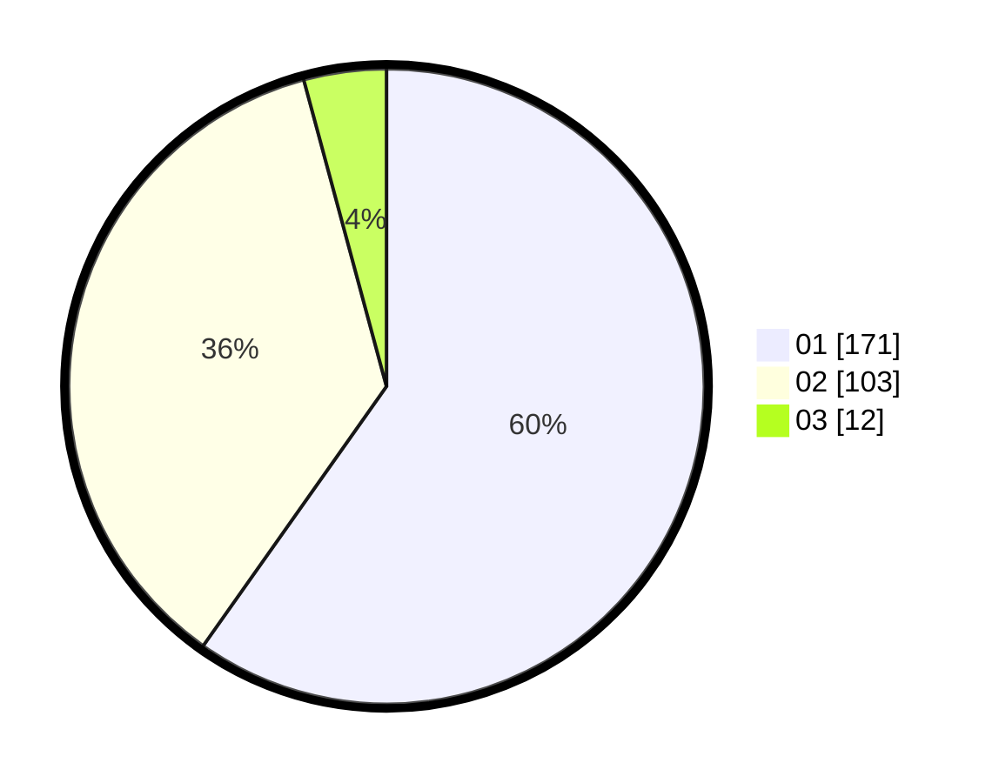

# Hasil

Hasil perolehan suara paslon dapat dilihat pada file paslon-01.txt, paslon-02.txt, dan paslon-03.txt.

Jika tidak ada, artinya data tersebut belum ada pada SIREKAP.

## Perolehan Suara

 * Paslon 01: **171**.
 * Paslon 02: **103**.
 * Paslon 03: **12**.

## Foto C Plano

https://sirekap-obj-formc.kpu.go.id/8081/pemilu/ppwp/31/72/04/10/03/3172041003019-20240215-023210--8d822e84-6ac1-4190-91ec-f832951861af.jpg

https://sirekap-obj-formc.kpu.go.id/8081/pemilu/ppwp/31/72/04/10/03/3172041003019-20240215-023225--efd0f61d-7ec2-4487-8171-917129066668.jpg

https://sirekap-obj-formc.kpu.go.id/8081/pemilu/ppwp/31/72/04/10/03/3172041003019-20240214-200351--9a830d5a-fa78-4737-a9e5-ca05bc4dcf4e.jpg

## DATA PEMILIH TETAP

Jumlah pemilih dalam DPT: **288**.
 * L: **137**.
 * P: **151**.

## DATA PENGGUNA HAK PILIH

Jumlah pengguna hak pilih dalam DPT: **231**.
 * L: **102**.
 * P: **129**.

Jumlah pengguna hak pilih dalam DPTb: **3**.
 * L: **1**.
 * P: **2**.

Jumlah pengguna hak pilih dalam DPK: **0**.
 * L: **0**.
 * P: **0**.

Jumlah pengguna hak pilih: **234**.
 * L: **103**.
 * P: **131**.

## JUMLAH SUARA SAH DAN TIDAK SAH

JUMLAH SELURUH SUARA SAH: **232**.

JUMLAH SUARA TIDAK SAH: **2**.

JUMLAH SELURUH SUARA SAH DAN SUARA TIDAK SAH: **234**.
