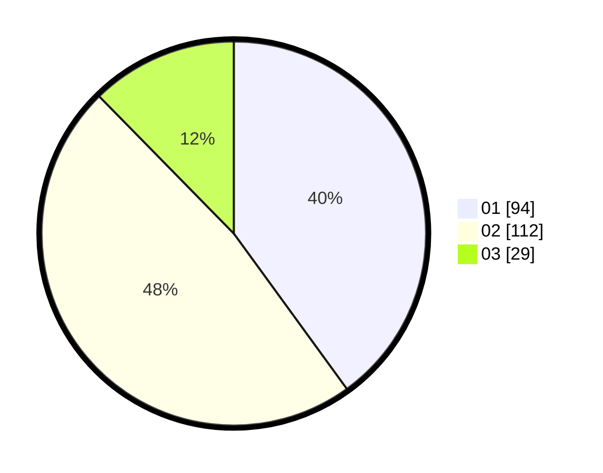

# Hasil

Hasil perolehan suara paslon dapat dilihat pada file paslon-01.txt, paslon-02.txt, dan paslon-03.txt.

Jika tidak ada, artinya data tersebut belum ada pada SIREKAP.

## Perolehan Suara

 * Paslon 01: **94**.
 * Paslon 02: **112**.
 * Paslon 03: **29**.

## Foto C Plano

https://sirekap-obj-formc.kpu.go.id/79df/pemilu/ppwp/31/72/04/10/03/3172041003024-20240216-015239--78e8c3f2-1ad4-4b6c-b0a6-c5e6aca70053.jpg

https://sirekap-obj-formc.kpu.go.id/79df/pemilu/ppwp/31/72/04/10/03/3172041003024-20240216-015241--269ede98-9c3f-47c1-b967-62fcf2968f2c.jpg

https://sirekap-obj-formc.kpu.go.id/79df/pemilu/ppwp/31/72/04/10/03/3172041003024-20240216-015239--539036f7-bc72-40b4-aa1d-90a7ca8638ab.jpg

## DATA PEMILIH TETAP

Jumlah pemilih dalam DPT: **0**.
 * L: **0**.
 * P: **0**.

## DATA PENGGUNA HAK PILIH

Jumlah pengguna hak pilih dalam DPT: **0**.
 * L: **0**.
 * P: **0**.

Jumlah pengguna hak pilih dalam DPTb: **0**.
 * L: **0**.
 * P: **0**.

Jumlah pengguna hak pilih dalam DPK: **0**.
 * L: **0**.
 * P: **0**.

Jumlah pengguna hak pilih: **0**.
 * L: **0**.
 * P: **0**.

## JUMLAH SUARA SAH DAN TIDAK SAH

JUMLAH SELURUH SUARA SAH: **235**.

JUMLAH SUARA TIDAK SAH: **4**.

JUMLAH SELURUH SUARA SAH DAN SUARA TIDAK SAH: **239**.
