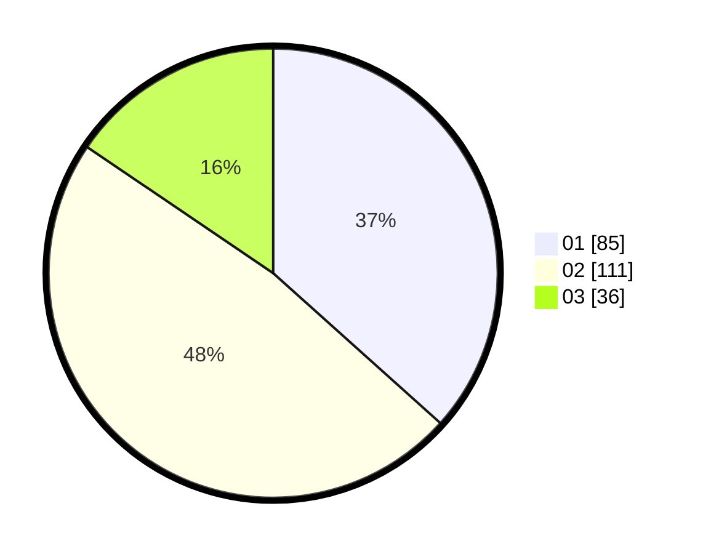

# Hasil

Hasil perolehan suara paslon dapat dilihat pada file paslon-01.txt, paslon-02.txt, dan paslon-03.txt.

Jika tidak ada, artinya data tersebut belum ada pada SIREKAP.

## Perolehan Suara

 * Paslon 01: **85**.
 * Paslon 02: **111**.
 * Paslon 03: **36**.

## Foto C Plano

https://sirekap-obj-formc.kpu.go.id/6c8c/pemilu/ppwp/31/72/04/10/03/3172041003033-20240216-132200--4a103b5c-81f1-4993-aa50-7d5e7a4abc23.jpg

https://sirekap-obj-formc.kpu.go.id/6c8c/pemilu/ppwp/31/72/04/10/03/3172041003033-20240216-132202--d795b5d3-333a-4e07-b496-d2e7ccbe5c2e.jpg

https://sirekap-obj-formc.kpu.go.id/6c8c/pemilu/ppwp/31/72/04/10/03/3172041003033-20240216-132201--9035249d-21d8-4a9d-a477-14ae43684464.jpg

## DATA PEMILIH TETAP

Jumlah pemilih dalam DPT: **289**.
 * L: **138**.
 * P: **151**.

## DATA PENGGUNA HAK PILIH

Jumlah pengguna hak pilih dalam DPT: **231**.
 * L: **109**.
 * P: **122**.

Jumlah pengguna hak pilih dalam DPTb: **2**.
 * L: **0**.
 * P: **2**.

Jumlah pengguna hak pilih dalam DPK: **0**.
 * L: **0**.
 * P: **0**.

Jumlah pengguna hak pilih: **233**.
 * L: **109**.
 * P: **124**.

## JUMLAH SUARA SAH DAN TIDAK SAH

JUMLAH SELURUH SUARA SAH: **232**.

JUMLAH SUARA TIDAK SAH: **1**.

JUMLAH SELURUH SUARA SAH DAN SUARA TIDAK SAH: **233**.
