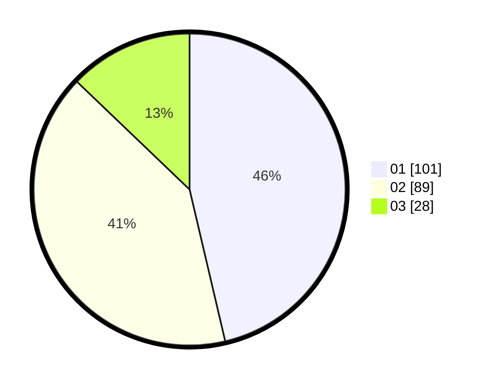

# Hasil

Hasil perolehan suara paslon dapat dilihat pada file paslon-01.txt, paslon-02.txt, dan paslon-03.txt.

Jika tidak ada, artinya data tersebut belum ada pada SIREKAP.

## Perolehan Suara

 * Paslon 01: **101**.
 * Paslon 02: **89**.
 * Paslon 03: **28**.

## Foto C Plano

https://sirekap-obj-formc.kpu.go.id/df21/pemilu/ppwp/31/72/04/10/03/3172041003041-20240214-155512--0468b0ac-f77b-4037-aa19-86bb53052f21.jpg

https://sirekap-obj-formc.kpu.go.id/df21/pemilu/ppwp/31/72/04/10/03/3172041003041-20240214-155315--31839489-72e3-46ad-841c-03b7a0292c2a.jpg

https://sirekap-obj-formc.kpu.go.id/df21/pemilu/ppwp/31/72/04/10/03/3172041003041-20240214-155044--f0e477d3-1dce-40ab-ae5b-30a34b366fce.jpg

## DATA PEMILIH TETAP

Jumlah pemilih dalam DPT: **265**.
 * L: **129**.
 * P: **136**.

## DATA PENGGUNA HAK PILIH

Jumlah pengguna hak pilih dalam DPT: **218**.
 * L: **102**.
 * P: **116**.

Jumlah pengguna hak pilih dalam DPTb: **0**.
 * L: **0**.
 * P: **0**.

Jumlah pengguna hak pilih dalam DPK: **5**.
 * L: **1**.
 * P: **4**.

Jumlah pengguna hak pilih: **223**.
 * L: **103**.
 * P: **120**.

## JUMLAH SUARA SAH DAN TIDAK SAH

JUMLAH SELURUH SUARA SAH: **218**.

JUMLAH SUARA TIDAK SAH: **5**.

JUMLAH SELURUH SUARA SAH DAN SUARA TIDAK SAH: **223**.
