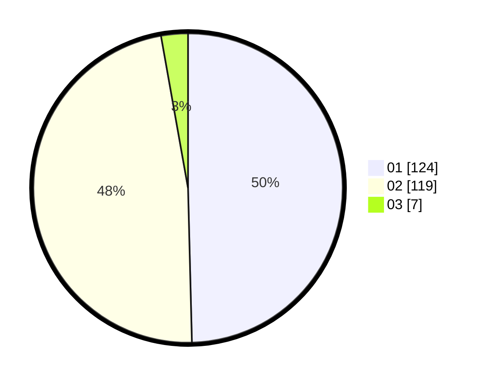

# Hasil

Hasil perolehan suara paslon dapat dilihat pada file paslon-01.txt, paslon-02.txt, dan paslon-03.txt.

Jika tidak ada, artinya data tersebut belum ada pada SIREKAP.

## Perolehan Suara

 * Paslon 01: **124**.
 * Paslon 02: **119**.
 * Paslon 03: **7**.

## Foto C Plano

https://sirekap-obj-formc.kpu.go.id/3d23/pemilu/ppwp/31/72/04/10/03/3172041003046-20240214-185830--b0e449fb-3469-44f1-ba15-78c56d65fe7c.jpg

https://sirekap-obj-formc.kpu.go.id/3d23/pemilu/ppwp/31/72/04/10/03/3172041003046-20240214-191036--c364c5ba-ee97-4c10-be9e-f6de40c8e305.jpg

https://sirekap-obj-formc.kpu.go.id/3d23/pemilu/ppwp/31/72/04/10/03/3172041003046-20240214-185837--24a52bb6-802a-4453-9730-5d3e9f3eafa7.jpg

## DATA PEMILIH TETAP

Jumlah pemilih dalam DPT: **295**.
 * L: **144**.
 * P: **151**.

## DATA PENGGUNA HAK PILIH

Jumlah pengguna hak pilih dalam DPT: **248**.
 * L: **116**.
 * P: **132**.

Jumlah pengguna hak pilih dalam DPTb: **4**.
 * L: **3**.
 * P: **1**.

Jumlah pengguna hak pilih dalam DPK: **0**.
 * L: **0**.
 * P: **0**.

Jumlah pengguna hak pilih: **252**.
 * L: **119**.
 * P: **133**.

## JUMLAH SUARA SAH DAN TIDAK SAH

JUMLAH SELURUH SUARA SAH: **250**.

JUMLAH SUARA TIDAK SAH: **2**.

JUMLAH SELURUH SUARA SAH DAN SUARA TIDAK SAH: **252**.
