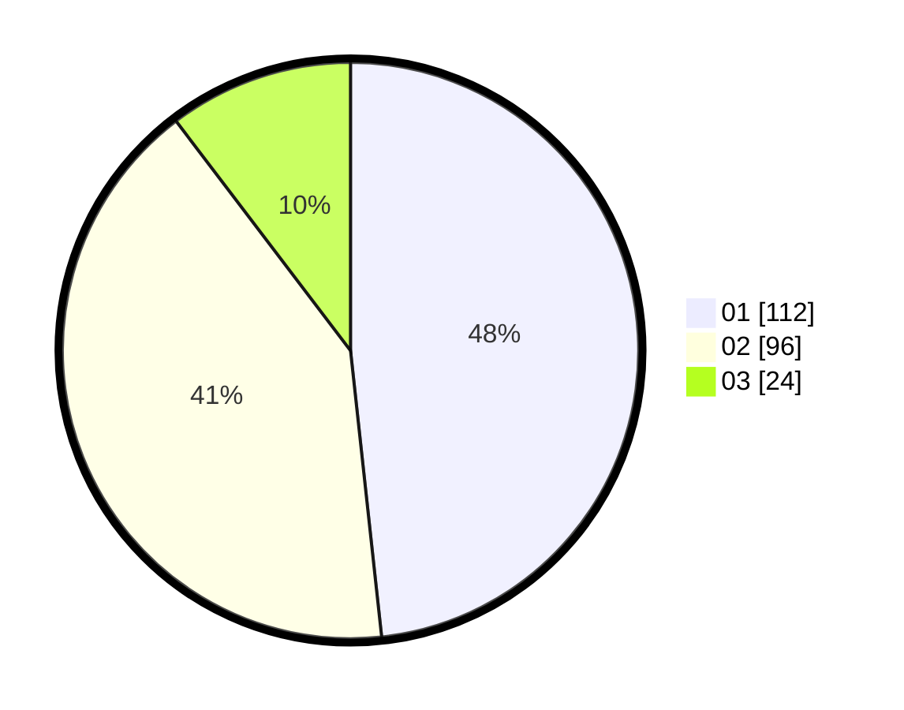

# Hasil

Hasil perolehan suara paslon dapat dilihat pada file paslon-01.txt, paslon-02.txt, dan paslon-03.txt.

Jika tidak ada, artinya data tersebut belum ada pada SIREKAP.

## Perolehan Suara

 * Paslon 01: **112**.
 * Paslon 02: **96**.
 * Paslon 03: **24**.

## Foto C Plano

https://sirekap-obj-formc.kpu.go.id/2919/pemilu/ppwp/31/72/04/10/03/3172041003047-20240214-185848--f5da1ac5-e857-4090-ab54-e93df6b3ae62.jpg

https://sirekap-obj-formc.kpu.go.id/2919/pemilu/ppwp/31/72/04/10/03/3172041003047-20240214-185442--ba4bc72f-63f4-42e2-874d-b4d41d89f7a8.jpg

https://sirekap-obj-formc.kpu.go.id/2919/pemilu/ppwp/31/72/04/10/03/3172041003047-20240214-185418--5b147cfb-eade-4fe5-acee-29dc41b1014b.jpg

## DATA PEMILIH TETAP

Jumlah pemilih dalam DPT: **295**.
 * L: **155**.
 * P: **140**.

## DATA PENGGUNA HAK PILIH

Jumlah pengguna hak pilih dalam DPT: **229**.
 * L: **113**.
 * P: **116**.

Jumlah pengguna hak pilih dalam DPTb: **0**.
 * L: **0**.
 * P: **0**.

Jumlah pengguna hak pilih dalam DPK: **7**.
 * L: **3**.
 * P: **4**.

Jumlah pengguna hak pilih: **236**.
 * L: **116**.
 * P: **120**.

## JUMLAH SUARA SAH DAN TIDAK SAH

JUMLAH SELURUH SUARA SAH: **232**.

JUMLAH SUARA TIDAK SAH: **4**.

JUMLAH SELURUH SUARA SAH DAN SUARA TIDAK SAH: **236**.
