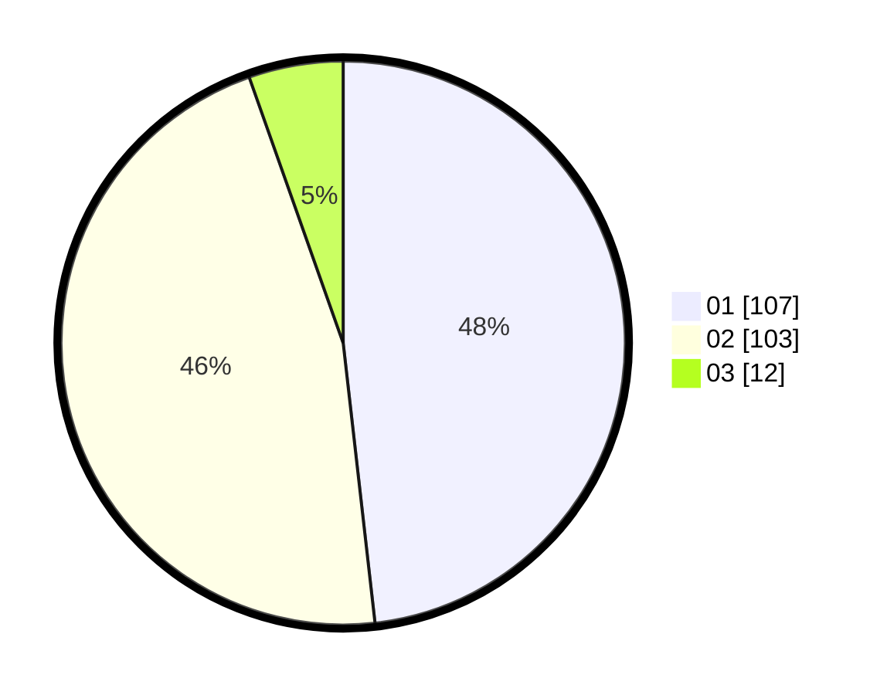

# Hasil

Hasil perolehan suara paslon dapat dilihat pada file paslon-01.txt, paslon-02.txt, dan paslon-03.txt.

Jika tidak ada, artinya data tersebut belum ada pada SIREKAP.

## Perolehan Suara

 * Paslon 01: **107**.
 * Paslon 02: **103**.
 * Paslon 03: **12**.

## Foto C Plano

https://sirekap-obj-formc.kpu.go.id/03a4/pemilu/ppwp/31/72/04/10/03/3172041003052-20240216-052613--b494210a-baa5-46bc-ad88-99e8d00862e2.jpg

https://sirekap-obj-formc.kpu.go.id/03a4/pemilu/ppwp/31/72/04/10/03/3172041003052-20240216-052616--68062ad0-5040-4b3b-8c0e-04b14babd42b.jpg

https://sirekap-obj-formc.kpu.go.id/03a4/pemilu/ppwp/31/72/04/10/03/3172041003052-20240216-052614--08c6529c-864d-4bec-ae97-3c1af4fed1b4.jpg

## DATA PEMILIH TETAP

Jumlah pemilih dalam DPT: **268**.
 * L: **137**.
 * P: **131**.

## DATA PENGGUNA HAK PILIH

Jumlah pengguna hak pilih dalam DPT: **219**.
 * L: **109**.
 * P: **110**.

Jumlah pengguna hak pilih dalam DPTb: **0**.
 * L: **0**.
 * P: **0**.

Jumlah pengguna hak pilih dalam DPK: **5**.
 * L: **3**.
 * P: **2**.

Jumlah pengguna hak pilih: **224**.
 * L: **112**.
 * P: **112**.

## JUMLAH SUARA SAH DAN TIDAK SAH

JUMLAH SELURUH SUARA SAH: **222**.

JUMLAH SUARA TIDAK SAH: **2**.

JUMLAH SELURUH SUARA SAH DAN SUARA TIDAK SAH: **224**.
