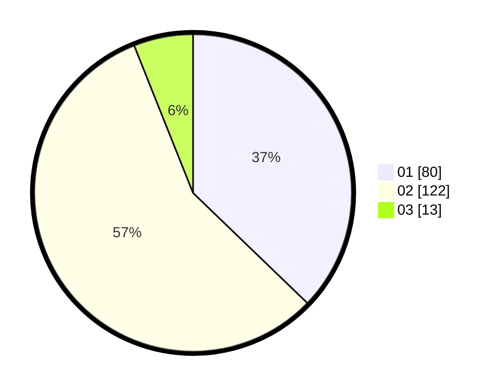

# Hasil

Hasil perolehan suara paslon dapat dilihat pada file paslon-01.txt, paslon-02.txt, dan paslon-03.txt.

Jika tidak ada, artinya data tersebut belum ada pada SIREKAP.

## Perolehan Suara

 * Paslon 01: **80**.
 * Paslon 02: **122**.
 * Paslon 03: **13**.

## Foto C Plano

https://sirekap-obj-formc.kpu.go.id/ffd8/pemilu/ppwp/31/72/04/10/03/3172041003062-20240214-193436--bb3a3dbb-615a-43fc-8245-802be2fff1aa.jpg

https://sirekap-obj-formc.kpu.go.id/ffd8/pemilu/ppwp/31/72/04/10/03/3172041003062-20240214-193444--ddd4bc8c-b571-43d5-89db-12dc8986517e.jpg

https://sirekap-obj-formc.kpu.go.id/ffd8/pemilu/ppwp/31/72/04/10/03/3172041003062-20240214-193457--f71af415-58e5-4294-8c1f-d8d6c215fa8d.jpg

## DATA PEMILIH TETAP

Jumlah pemilih dalam DPT: **293**.
 * L: **135**.
 * P: **158**.

## DATA PENGGUNA HAK PILIH

Jumlah pengguna hak pilih dalam DPT: **215**.
 * L: **95**.
 * P: **120**.

Jumlah pengguna hak pilih dalam DPTb: **1**.
 * L: **0**.
 * P: **1**.

Jumlah pengguna hak pilih dalam DPK: **0**.
 * L: **0**.
 * P: **0**.

Jumlah pengguna hak pilih: **216**.
 * L: **95**.
 * P: **121**.

## JUMLAH SUARA SAH DAN TIDAK SAH

JUMLAH SELURUH SUARA SAH: **215**.

JUMLAH SUARA TIDAK SAH: **1**.

JUMLAH SELURUH SUARA SAH DAN SUARA TIDAK SAH: **216**.
